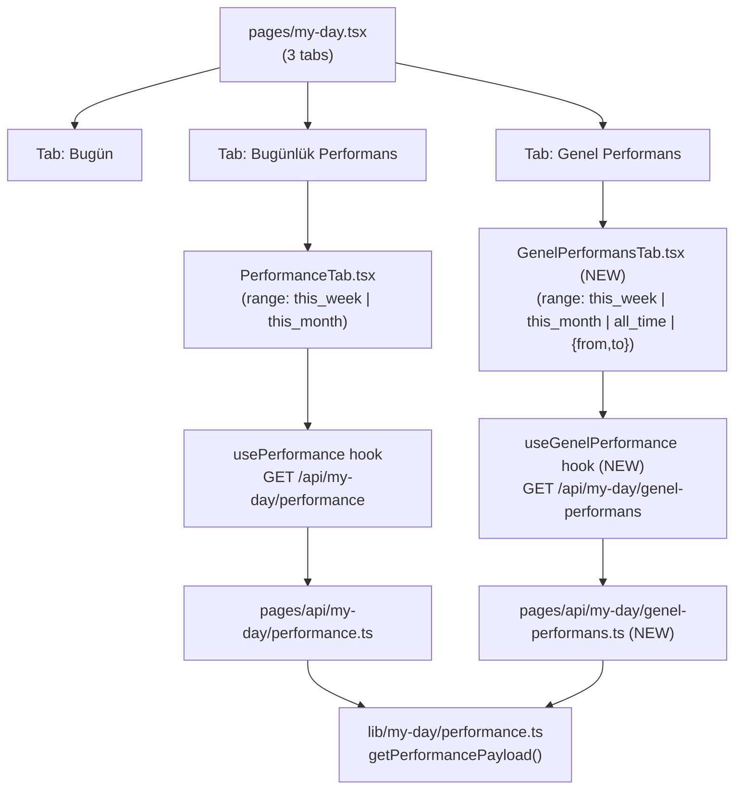

# My Day — Bugünlük & Genel Performans

## Architecture Overview



**Key reuse decision:** both screens call the same `getPerformancePayload()` in [`lib/my-day/performance.ts`](lib/my-day/performance.ts). The Genel endpoint passes `allTimeLeads: true` which switches the Leadlerim query from `claimed_at IN range` to `assigned_to = userId` with no date filter.

---

## Range selector design

`GenelPerformansTab` exposes four range modes encoded in a single discriminated union:

```typescript
type GenelRange = 'this_week' | 'this_month' | 'all_time' | { from: string; to: string }; // ISO date strings
```

- **Bu hafta / Bu ay / Tüm zamanlar** — pill button group (same pattern as current PerformanceTab)
- **Özel aralık** — becomes active when neither preset matches; renders two native `<input type="date">` elements inline below the button group. No new dependency — `date-fns` is already installed and is enough for formatting. Fires the query only when both inputs have valid values.

---

## Changes needed

### 1. `lib/my-day/performance.ts`

Four changes to `getPerformancePayload()`:

#### 1a. Add `opts?: { allTimeLeads?: boolean }` parameter — with unified portfolio count

When `allTimeLeads` is true, a single `portfolioCount` is computed instead of `claimedCount`:

```typescript
// pseudo-code — replaces the current lines 80–85 block
let claimedCount: number | null;
let portfolioCount: number | null = null;

if (opts?.allTimeLeads) {
  // All leads ever assigned — includes claimed_at = NULL
  const { count } = await client
    .from('leads')
    .select('uuid', { count: 'exact', head: true })
    .eq('assigned_to', userId)
    .eq('is_deleted', false);
  portfolioCount = count;
} else {
  // Windowed: leads claimed in range (existing behaviour)
  const { count } = await client
    .from('leads')
    .select('uuid', { count: 'exact', head: true })
    .eq('assigned_to', userId)
    .gte('claimed_at', fromIso)
    .lte('claimed_at', toIso);
  claimedCount = count;
}

const leadBase = opts?.allTimeLeads ? (portfolioCount ?? 0) : (claimedCount ?? 0);
```

`leadBase` is then used for **both** `kpi.leads` (line 235) **and** `conversionFunnel[0]` (line 142), so the tile and the funnel denominator always agree. This is the fix for the mismatch where `claimedCount` excludes `claimed_at = NULL` leads but the KPI tile counts them.

#### 1b. Arama — NO change

Leave the Arama query as-is (`salesperson_id = userId`). The metric means "calls I personally made" — counting a manager's calls on my leads toward my personal-effort tile would inflate it misleadingly. ~~The `.or()` union change is dropped from the plan.~~

#### 1c. Fix Ziyaret — change from lead-ownership to `created_by`

Replace `.in('lead_uuid', myLeadUuids)` with `.eq('created_by', userId)` at lines 111–117 (the KPI Ziyaret count) and lines 154–160 (the visitShowRate section):

```typescript
// Before (lines 111–117):
const { data: visitedLeads } = await client
  .from('visits')
  .select('lead_uuid')
  .in('lead_uuid', myLeadUuids) // ← remove
  .in('status', ['attended', 'failed'])
  .gte('scheduled_date', fromIso)
  .lte('scheduled_date', toIso);

// After:
const { data: visitedLeads } = await client
  .from('visits')
  .select('lead_uuid')
  .eq('created_by', userId) // ← new
  .in('status', ['attended', 'failed'])
  .gte('scheduled_date', fromIso)
  .lte('scheduled_date', toIso);
```

Same substitution for the `visitShowRate` block at lines 154–160.

**Pre-condition (see DB check below):** this change is only safe once the `created_by IS NULL` count is confirmed to be zero.

#### 1d. Add `all_time` to `resolvePerformanceRange()` — Istanbul-anchored upper bound

```typescript
if (rangeParam === 'all_time') {
  return {
    from: new Date(0), // 1970-01-01 UTC — fine as-is
    to: new Date('2099-12-31T23:59:59+03:00'), // Istanbul-anchored, matches convention
  };
}
```

The upper bound is changed from the originally proposed `new Date('2099-12-31')` (UTC midnight) to `new Date('2099-12-31T23:59:59+03:00')` to match the `+03:00` convention used by `istanbulTodayBounds` and `istanbulWeekStart` in [`lib/time/istanbul.ts`](lib/time/istanbul.ts).

### 2. `pages/my-day.tsx`

- Rename `TabsTrigger` label `"Performansım"` → `"Bugünlük Performans"`
- Add third `TabsTrigger` + `TabsContent` for `"genel"` → renders `<GenelPerformansTab />`

### 3. `components/my-day/PerformanceTab.tsx`

- Rename KPI tile label `"Leadlerim"` → `"Bugün aldığım leadler"`

### 4. `hooks/usePerformance.ts`

No changes needed (Bugünlük tab keeps `this_week | this_month` only).

### 5. `pages/api/my-day/genel-performans.ts` _(new file)_

Mirrors [`pages/api/my-day/performance.ts`](pages/api/my-day/performance.ts) but:

- Extends range parsing to handle `range=all_time`
- Passes `{ allTimeLeads: true }` to `getPerformancePayload()` when `range === 'all_time'`

### 6. `hooks/useGenelPerformance.ts` _(new file)_

```typescript
type GenelRange = 'this_week' | 'this_month' | 'all_time' | { from: string; to: string };

export function useGenelPerformance(range: GenelRange) {
  // Builds ?range=... or ?from=...&to=... query string
  // Returns useSWR<PerformancePayload>(url, fetcher)
}
```

### 7. `components/my-day/GenelPerformansTab.tsx` _(new file)_

Structure mirrors `PerformanceTab.tsx` with these differences:

- Range state is `GenelRange` (4 options instead of 2)
- Button group: Bu hafta | Bu ay | Tüm zamanlar — when none selected, shows custom date inputs
- "Özel aralık" renders `<input type="date">` × 2, queries only when both are filled
- KPI tile "Leadlerim" label stays as "Leadlerim" (not "Bugün aldığım leadler")
- All secondary sections (Dönüşümler, Bağlantı Oranı, Kayıp Nedenleri, Takılı Leadler, Ziyaret Gösterim Oranı) are copied identically

---

## Pre-ship database check — COMPLETED

`SELECT COUNT(*) FROM visits WHERE created_by IS NULL` returned **0**.

All existing visits have `created_by` populated. The `.eq('created_by', userId)` Ziyaret filter is safe to ship as-is. No backfill or fallback query needed.

---

## File summary

| File                                       | Status | What changes                                                                                                            |
| ------------------------------------------ | ------ | ----------------------------------------------------------------------------------------------------------------------- |
| `lib/my-day/performance.ts`                | Modify | Ziyaret fix (created_by), unified `leadBase` for KPI+funnel, `allTimeLeads` flag, Istanbul-anchored `all_time` sentinel |
| `pages/my-day.tsx`                         | Modify | Tab rename + add third tab                                                                                              |
| `components/my-day/PerformanceTab.tsx`     | Modify | KPI label rename only                                                                                                   |
| `pages/api/my-day/genel-performans.ts`     | New    | API handler                                                                                                             |
| `hooks/useGenelPerformance.ts`             | New    | SWR hook                                                                                                                |
| `components/my-day/GenelPerformansTab.tsx` | New    | Full tab UI                                                                                                             |

No database migrations required. `visits.created_by` already exists and is already being written. Arama query is unchanged from current behaviour.
