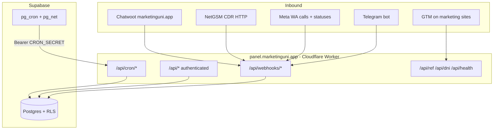

# Univotel CRM — Engineering Onboarding

Welcome. This guide orients new engineers to the **current codebase**, the **original plan documents**, and **production operations**. Read this first, then keep [`docs/runbook.md`](./runbook.md) open for incidents.

For a **current-state snapshot** (filters, hotel rec, migrations through `0047`), see [`docs/engineering-handoff.md`](./engineering-handoff.md). For NetGSM depth, see [`docs/netgsm-integration.md`](./netgsm-integration.md).

**Production:** https://panel.marketinguni.app  
**Repo:** Next.js 15 (Pages Router) on Cloudflare Workers (OpenNext) + Supabase Postgres.

---

## 1. What we are building

Univotel CRM is an internal **lead operations platform** for student housing sales (Turkey). It:

- Ingests leads from **Chatwoot** (WhatsApp / Instagram), **NetGSM** (phone calls), and **Meta WhatsApp** (voice calls + campaign delivery status)
- Normalizes phones, deduplicates, **auto-assigns** salespeople, tracks **SLA** and **tasks**
- Sends **Telegram** alerts to managers and agents
- Runs **WhatsApp template campaigns** (manager UI)
- Tracks **marketing attribution** (REF, UTM, DNI, GA4) in `collected_data`
- **Archives** terminal leads after 80 days
- Exposes a **manager/salesperson UI** for day-to-day work

Historical Chatwoot imports live in **`old_leads`** (read-only). Active leads use the live pipeline + optional **Conversation** tab (Chatwoot API cache in `lead_messages`).

---

## 2. Plan documents vs repo (phases)

Authoritative product specs live in **`phase_documents/`** (Word). The repo has outpaced some plan wording — trust **code + runbook** for behavior.

| Phase | Plan focus                                | Tables / features (high level)                                                   | Status in repo                                                |
| ----- | ----------------------------------------- | -------------------------------------------------------------------------------- | ------------------------------------------------------------- |
| **1** | Core CRM, 3 webhooks, assignment, SLA, UI | `leads`, `lead_details`, `properties`, `salespeople`, `contact_history`, `tasks` | **Done**                                                      |
| **2** | Audit, campaigns, notifications           | `webhook_logs`, `campaigns`, `campaign_leads`, `notifications`                   | **Done** (ElevenLabs / n8n **not** implemented)               |
| **3** | Archive                                   | `archived_leads`, archive cron, manager archive UI                               | **Done**                                                      |
| **4** | Attribution                               | `ref_sessions`, `dni_numbers`, `collected_data`, GA4 cron, public REF/DNI APIs   | **Code done**; GTM/Meta/GA4 **external wiring** often pending |
| **5** | Automation rules, voice                   | `automation_rules`, rule engine                                                  | **Not built** — planned n8n / future phase                    |

**Deferred by design (not missing by accident):**

- **n8n** — orchestration for complex flows; optional for outbound campaign _triggers_
- **Chatwoot custom attributes → CRM** (`hotel`, `university`, `budget`, `move-in`) — can be added in CRM via `conversation_updated` (same pattern as labels); plan originally deferred to n8n
- **`rec_hotel` auto-recommendation** — column exists; no filler workflow yet
- **ElevenLabs / outbound voice calls**

---

## 3. Architecture (runtime)



**Important patterns:**

- Webhooks **await** processing before HTTP 200 (Worker isolate safety).
- **`lib/`** = business logic (no React). **`pages/api/`** = thin handlers. **`components/`** = UI only.
- **Service role** client (`lib/supabase/service.ts`) for webhooks/cron — bypasses RLS; never import from UI code paths.
- **Session middleware** (`middleware.ts`) refreshes Supabase auth cookies on pages/API **except** webhooks, cron, ref, dni, health.

---

## 4. Repository map

```
├── pages/                 # Pages Router: UI routes + API routes
│   ├── api/webhooks/      # chatwoot, netgsm, whatsapp-calls, telegram
│   ├── api/cron/          # sla-alerts, task-overdue, campaign-resume, ga4-enrichment
│   ├── api/leads/         # CRUD, archive, attribution, messages (live chat)
│   ├── api/old-leads/     # Historical import (read-only)
│   ├── api/campaigns/     # Manager campaigns
│   └── leads/, campaigns/, webhook-logs/, ...
├── lib/
│   ├── leads/             # create, assign, dedupe, SLA, archive, chat sync
│   ├── webhooks/          # processors, verify, webhook_logs, idempotency
│   ├── chatwoot/          # API client, label sync, messages
│   ├── campaigns/         # segment, worker, WhatsApp template send
│   ├── attribution/       # collected_data, confidence
│   ├── notifications/     # Telegram throttle + DB
│   ├── jobs/              # cron runners
│   ├── auth/              # session user, roles
│   └── env.ts             # Zod-validated env (fail fast)
├── components/            # React UI (shadcn-style primitives under ui/)
├── hooks/                 # SWR data hooks
├── types/                 # domain.ts, api.ts, database.ts (generated), webhooks.ts
├── supabase/migrations/   # 0001–0047 sequential SQL
├── scripts/               # gen-types, imports, telegram, chatwoot agent sync
├── __tests__/lib/         # Vitest unit tests (pure logic + processors)
├── docs/runbook.md        # Production ops (primary on-call doc)
└── phase_documents/       # Original Word specs (Phases 1–4 + master plan)
```

**Types:** After any migration, run `pnpm gen:types` → updates `types/database.ts`.

---

## 5. Day 1 — local setup

### Prerequisites

- Node.js **20+**, pnpm **9+**
- Docker (optional; for local Supabase)
- Supabase CLI (bundled via `pnpm`; `pnpm exec supabase login` once)

### Commands

```bash
cd "/path/to/Univotel CRM"
pnpm install
cp .env.example .env.local
# Fill all required keys (see lib/env.ts — app won't start without them)
pnpm gen:types
pnpm dev
```

Open http://localhost:3000

### Auth for local UI

1. Create Supabase Auth users matching emails in `supabase/seed.sql`.
2. Set each user's **UUID = `salespeople.id`** for that row (RLS depends on this).

### Local dev gotchas

| Issue                                          | Fix                                                                                     |
| ---------------------------------------------- | --------------------------------------------------------------------------------------- |
| Webhook returns HTML 500 `self is not defined` | Latest `middleware.ts` excludes `/api/webhooks/*`; `rm -rf .next` && restart `pnpm dev` |
| Port in use                                    | Next picks 3001/3002 — read terminal `Local:` line                                      |
| NetGSM test from laptop                        | `curl localhost:3000/api/webhooks/netgsm` works; **real calls** need prod URL or tunnel |
| Secrets                                        | Local uses **`.env.local`** only; Wrangler secrets apply to **deploy** only             |

### Quality gate before PR / deploy

```bash
pnpm test
pnpm build
```

---

## 6. Environment variables

Validated in `lib/env.ts` (Zod). Copy from [`.env.example`](../.env.example).

| Variable                                         | Purpose                               |
| ------------------------------------------------ | ------------------------------------- |
| `NEXT_PUBLIC_SUPABASE_*`                         | Browser + server Supabase             |
| `SUPABASE_SERVICE_ROLE_KEY`                      | Webhooks, cron, imports               |
| `CHATWOOT_WEBHOOK_SECRET`                        | Inbound Chatwoot HMAC                 |
| `CHATWOOT_API_TOKEN`, `CHATWOOT_ACCOUNT_ID`      | Outbound sync + live Conversation tab |
| `CHATWOOT_SYNC_*`                                | Two-way label/assignee sync flags     |
| `WHATSAPP_*`                                     | Meta webhook + campaign send          |
| `NETGSM_STATIC_TOKEN`                            | NetGSM body `token`                   |
| `TELEGRAM_*`                                     | Manager + agent alerts                |
| `CRON_SECRET`                                    | pg_cron HTTP callbacks (≥32 chars)    |
| `GOOGLE_SERVICE_ACCOUNT_JSON`, `GA4_PROPERTY_ID` | Optional GA4 enrichment               |
| `NEXT_PUBLIC_APP_URL`                            | App base URL                          |

**Production:** Cloudflare Wrangler secrets + Supabase `cron_settings` (`base_url`, `cron_secret`) must match `CRON_SECRET`.

---

## 7. Roles and access

| Role          | UI / data                                                                                    |
| ------------- | -------------------------------------------------------------------------------------------- |
| `salesperson` | Assigned + **unassigned** active leads; own tasks; no archive, no old-leads, no webhook-logs |
| `manager`     | All active + archived leads; campaigns; notifications; webhook-logs; analytics               |
| `superadmin`  | Manager access + **`/admin/dni-numbers`**                                                    |

Helpers: `lib/auth/roles.ts` — `isManagerOrAbove()`, `isSuperadmin()`, `canAccessDniAdmin()`.

**RLS** enforces row access in Postgres; API routes also check session role.

---

## 8. Core business flows (where to read code)

### 8.1 New lead from webhook

1. `pages/api/webhooks/{source}.ts` → `createWebhookHandler` (`lib/webhooks/create-webhook-handler.ts`)
2. `runWithWebhookLog` — idempotency + `webhook_logs` row
3. `lib/webhooks/process-*.ts` → `createLeadFromWebhook` (`lib/leads/create-lead.ts`)
4. Phone normalize (`lib/leads/normalize-phone.ts`), dedupe (`deduplicate.ts`), assign (`assign.ts`), SLA (`sla.ts`)
5. `collected_data` + optional GA4 queue (`lib/attribution/build-collected-data.ts`)

### 8.2 Chatwoot label / assignee sync

- `lib/webhooks/process-chatwoot.ts` — `conversation_updated` → label diff → CRM fields (`lib/constants.ts` `getLabelFieldTargets`)
- Outbound: `lib/chatwoot/sync-engine.ts`, `sync-labels.ts` — echo guard `CHATWOOT_SYNC_ECHO_WINDOW_MS`

### 8.3 Live chat (active leads)

- UI: `components/leads/LeadChatView.tsx` — opens **Conversation** tab
- `POST /api/leads/[id]/messages/sync` → Chatwoot API → upsert `lead_messages` (migration `0041`)
- Poll every **15s** while tab open (`LEAD_CHAT_SYNC_POLL_MS` in `lib/constants.ts`)
- **Not** driven by Chatwoot message webhooks for display

### 8.4 Campaigns

- Manager UI `/campaigns` → `lib/campaigns/run-campaign-worker.ts` → Meta template API
- Status updates: `lib/webhooks/process-whatsapp-statuses.ts`
- Resume: pg_cron → `POST /api/cron/campaign-resume`

### 8.5 Archive

- Nightly SQL job (up to 100 leads) + manager manual archive
- Terminal funnel slugs: Turkish enums in DB (e.g. `sozlesme-imzalandi`) — see `lib/constants.ts`

---

## 9. Database migrations

**47 migrations** in `supabase/migrations/` (`0001`–`0047`). Apply in order on each environment.

Recent additions:

| Migration     | Purpose                                                         |
| ------------- | --------------------------------------------------------------- |
| `0033`–`0037` | superadmin, ref_sessions, dni_numbers, collected_data, GA4 cron |
| `0038`–`0039` | old_leads + import constraints                                  |
| `0040`        | old_lead_messages (dump import)                                 |
| `0041`        | lead_messages (live Chatwoot cache)                             |
| `0042`–`0044` | property availability, room types, physical rooms               |
| `0045`–`0046` | lead_details rec fields; drop redundant gender column           |
| `0047`        | `search_old_leads_ids` RPC (fuzzy old-lead search)              |

```bash
pnpm db:migrate    # supabase db push — use carefully on prod; prefer SQL editor for targeted apply
pnpm gen:types
```

**Do not** renumber migrations on production.

---

## 10. Webhook reference (quick)

| Endpoint                            | Auth                   | Creates lead when                               |
| ----------------------------------- | ---------------------- | ----------------------------------------------- |
| `POST /api/webhooks/chatwoot`       | HMAC                   | Incoming WA/IG message; reopen rules            |
| `POST /api/webhooks/netgsm`         | Body `token`           | `scenario: cdr` or inbound/hangup + ids + phone |
| `POST /api/webhooks/whatsapp-calls` | Meta HMAC              | `calls` array (not chat messages)               |
| `POST /api/webhooks/telegram`       | Optional secret header | Bot commands only                               |

Public (CORS): `GET /api/ref/generate`, `GET /api/dni/numbers`

Full curl examples and troubleshooting: **`docs/runbook.md` Section 4–5**.

---

## 11. Testing strategy

- **Vitest** unit tests in `__tests__/lib/` — run before every deploy
- Focus: phone normalize, dedupe, SLA, webhook verify, NetGSM normalize, Chatwoot schema, attribution confidence
- **No** full E2E Playwright suite in repo; Phase 4 checklist in `docs/phase_4_tests.md` is manual integration testing
- Webhook testing: signed curl against local or prod (see README + runbook)

---

## 12. Deployment

**Manual CLI** — no GitHub Actions deploy pipeline.

```bash
pnpm test && pnpm build
pnpm cf:deploy
```

- Worker name: `univotel-crm` (see `wrangler.jsonc`)
- Secrets: `pnpm exec wrangler secret list` / `wrangler secret put NAME`
- Post-deploy: `curl https://panel.marketinguni.app/api/health`

Convention: deploy from **`main`** after tests pass.

---

## 13. External systems checklist (ops)

These are **not** fully verifiable from code alone:

| System   | Owner action                                                                  |
| -------- | ----------------------------------------------------------------------------- |
| Chatwoot | Webhook URL, subscriptions, API token, agent sync script                      |
| NetGSM   | CDR/santral dinleme POST to `/api/webhooks/netgsm` (IVR function name ≠ HTTP) |
| Meta     | `calls` + `statuses` + optional `referral` field                              |
| GTM      | REF + DNI + `ref_generated` GA4 event on marketing sites                      |
| GA4      | Service account + `ref_code` dimension                                        |
| Telegram | Bot token, manager chat IDs, salesperson `/link`                              |
| Supabase | `cron_settings` row aligned with Wrangler `CRON_SECRET`                       |

Status tracking: `docs/phase_4_tests.md` (checkboxes).

---

## 14. Coding conventions

From `.cursor/rules/index.mdc` and existing code:

- **File header comment** — purpose of the module
- **Function comment blocks** — inputs/outputs on non-trivial exports
- **Zod** at API boundaries and webhook payloads (`types/webhooks.ts`)
- **API envelope:** `{ data: T }` / `{ error: string }` via `lib/api-helpers.ts`
- **No ORM** — Supabase client + generated types
- **Pages Router only** (not App Router) for API routes
- **Turkish funnel enums** — use constants in `lib/constants.ts`; do not invent English slugs

Optional team protocol: RESEARCH → PLAN → EXECUTE modes when using AI assistants (see `.cursor/rules`).

---

## 15. Suggested first tasks for new engineers

1. Run locally, log in as manager, create a manual lead, open slide-over **Conversation** (if Chatwoot API configured).
2. Read `lib/leads/create-lead.ts` and one processor (`process-chatwoot.ts`).
3. Trace one row in `webhook_logs` to processor outcome (Supabase SQL).
4. Skim `docs/runbook.md` Section 5 (common failures).
5. Read your phase’s Word doc in `phase_documents/` for product intent, then diff against repo if curious.

---

## 16. Document index

| Document                                                  | Use when                                    |
| --------------------------------------------------------- | ------------------------------------------- |
| [`docs/runbook.md`](./runbook.md)                         | Production incidents, curl tests, SQL debug |
| [`docs/engineering-handoff.md`](./engineering-handoff.md) | Current project state — handoff snapshot    |
| [`docs/netgsm-integration.md`](./netgsm-integration.md)   | NetGSM webhook, DNI, CDR, troubleshooting   |
| [`README.md`](../README.md)                               | Setup, webhook curl, deploy commands        |
| [`docs/phase_4_tests.md`](./phase_4_tests.md)             | Attribution / GTM / DNI integration QA      |
| `phase_documents/Univotel_CRM_Plan.docx`                  | Full 5-phase product spec                   |
| `phase_documents/Univotel_CRM_Phase*_Implementation.docx` | Phase-specific implementation notes         |
| **This file**                                             | Onboarding and mental model                 |

---

## 17. Who to ask / escalate

| Topic                  | Contact                    |
| ---------------------- | -------------------------- |
| NetGSM payload / CDR   | teknikdestek@netgsm.com.tr |
| Supabase outage        | status.supabase.com        |
| Cloudflare             | cloudflarestatus.com       |
| Product / funnel rules | Team + plan docs           |

---

_Last updated: 2026-05-28. Update this file when major architecture or phase scope changes._
