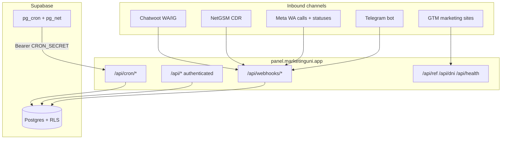

# Univotel CRM — Technical Onboarding Guide

**Last updated:** 2026-06-19  
**Production:** https://panel.marketinguni.app  
**Audience:** Engineers joining the project — first-week orientation through deep system knowledge.

This is the primary technical onboarding document. It covers product purpose, architecture, algorithms, database schema, API surface, and operational patterns. For production incidents use [`runbook.md`](./runbook.md). For a shorter current-state snapshot see [`engineering-handoff.md`](./engineering-handoff.md). For NetGSM-specific depth see [`netgsm-integration.md`](./netgsm-integration.md).

---

## Table of contents

1. [Product context](#1-product-context)
2. [Technology stack](#2-technology-stack)
3. [Runtime architecture](#3-runtime-architecture)
4. [Repository map](#4-repository-map)
5. [Local development setup](#5-local-development-setup)
6. [Environment variables](#6-environment-variables)
7. [Authentication, authorization, and RLS](#7-authentication-authorization-and-rls)
8. [Database schema](#8-database-schema)
9. [Lead lifecycle and domain model](#9-lead-lifecycle-and-domain-model)
10. [Lead creation pipeline](#10-lead-creation-pipeline)
11. [Assignment algorithm](#11-assignment-algorithm)
12. [SLA system](#12-sla-system)
13. [Deduplication](#13-deduplication)
14. [Archive system](#14-archive-system)
15. [Inbound webhooks](#15-inbound-webhooks)
16. [Chatwoot two-way sync](#16-chatwoot-two-way-sync)
17. [Live conversation and lead message notifications](#17-live-conversation-and-lead-message-notifications)
18. [Campaign system](#18-campaign-system)
19. [Marketing attribution](#19-marketing-attribution)
20. [Hotel recommendation (Make.com)](#20-hotel-recommendation-makecom)
21. [Universities reference data](#21-universities-reference-data)
22. [Deal awaiting and pipeline view](#22-deal-awaiting-and-pipeline-view)
23. [Lead list filters and query layer](#23-lead-list-filters-and-query-layer)
24. [Frontend architecture](#24-frontend-architecture)
25. [API reference](#25-api-reference)
26. [Scheduled jobs (pg_cron)](#26-scheduled-jobs-pg_cron)
27. [Telegram notifications](#27-telegram-notifications)
28. [Analytics](#28-analytics)
29. [My Day cockpit](#29-my-day-cockpit)
30. [Internationalization (i18n)](#30-internationalization-i18n)
31. [Testing strategy](#31-testing-strategy)
32. [Deployment](#32-deployment)
33. [Coding conventions](#33-coding-conventions)
34. [Known quirks and tech debt](#34-known-quirks-and-tech-debt)
35. [Document index and escalation](#35-document-index-and-escalation)
36. [Suggested first-week path](#36-suggested-first-week-path)

---

## 1. Product context

### What Univotel CRM is

Univotel CRM is an **internal student housing sales operations platform** for Turkey. It is not a generic CRM — every funnel stage, label, and field maps to Turkish sales workflows for university dormitory / private student housing placement.

The platform:

- **Ingests leads** from Chatwoot (WhatsApp / Instagram), NetGSM (GSM calls via CDR webhook), Meta WhatsApp (voice calls + campaign delivery statuses), and manual UI entry
- **Normalizes** phone numbers and Instagram handles, **deduplicates** active leads, **auto-assigns** salespeople
- **Tracks SLA** deadlines and **tasks** with Telegram alerts to managers and agents
- **Syncs two-way** with Chatwoot for funnel labels, custom attributes, and assignee
- **Runs WhatsApp template campaigns** (manager UI)
- **Stores marketing attribution** (REF codes, UTM, DNI, GA4) in `collected_data`
- **Archives** terminal leads after 80 days of inactivity
- **Browses historical Chatwoot imports** in read-only `old_leads` (~8.5k rows)
- **Shows live Conversation tab** on active leads (Chatwoot API cache + 15s poll)
- **Triggers hotel recommendations** via Make.com with property-level results in `lead_details.rec_hotel`
- **My Day cockpit** (`/my-day`) — personal counters, tasks, attention queue, performance tab for every salesperson
- **Manager analytics** on `/dashboard` — **Everyday**, **Marketing**, and **Loss Analysis** tabs (live-query dashboards with shared filters) plus **Team panel** (unchanged team KPIs/trends/table)
- **FMS** (`/fms/*`) — manager finance dashboard: revenue KPIs, partner/property breakdown, seasonal room prices
- **Stage compartment pages** — nurture, expecting-call, post-visit, downpayment, deal-signed, 24h-restricted, move-in, plus visit/move-in calendars
- **PMS** (`/pms/*`) — property management: room inventory, placements, operator write paths

### Business domain vocabulary

| Concept           | Meaning                                                                                    |
| ----------------- | ------------------------------------------------------------------------------------------ |
| **Lead**          | A prospective student (or parent) seeking housing                                          |
| **Funnel status** | Sales pipeline stage — Turkish slugs like `yeni`, `aranacak`, `sozlesme-imzalandi`         |
| **Persona**       | `ogrenci` (student) or `veli` (parent/guardian)                                            |
| **Student stage** | Enrollment timing: `pre-sinav`, `yerlesti`, `yatay-gecis-bekliyor`, etc.                   |
| **Deal awaiting** | Lead parked until a property deal closes — excluded from main list, SLA, and active counts |
| **Lost**          | Terminal funnel status set via Chatwoot `kayip_nedeni` custom attribute                    |
| **SLA**           | Time-to-first-response deadline; business hours 09:00–17:00 Istanbul                       |
| **DNI**           | Dynamic Number Insertion — virtual phone numbers mapped to ad sources                      |
| **REF**           | First-click attribution code generated by GTM on marketing sites                           |

### Phase history (plan vs repo)

Authoritative product specs live in **`phase_documents/`** (Word). The repo has outpaced some plan wording — **trust code + runbook** for behavior.

| Phase | Focus                                          | Status                                            |
| ----- | ---------------------------------------------- | ------------------------------------------------- |
| **1** | Core CRM, webhooks, assignment, SLA, UI        | Done                                              |
| **2** | Audit, campaigns, notifications, Chatwoot sync | Done (ElevenLabs / n8n not implemented)           |
| **3** | Archive pipeline + manager archive UI          | Done                                              |
| **4** | Attribution (REF, UTM, DNI, GA4)               | Code done; external GTM/Meta wiring often pending |
| **5** | Automation rules, voice                        | Not built                                         |

**Deferred by design:** n8n orchestration, ElevenLabs voice, Phase 5 automation rules.

---

## 2. Technology stack

| Layer           | Technology                                          | Notes                                              |
| --------------- | --------------------------------------------------- | -------------------------------------------------- |
| UI + API        | **Next.js 15 Pages Router**                         | Not App Router                                     |
| Runtime         | **Cloudflare Workers** via `@opennextjs/cloudflare` | Worker name: `univotel-crm`                        |
| Database        | **Supabase Postgres**                               | RLS on most tables; service role for webhooks/cron |
| Auth            | **Supabase Auth**                                   | Session cookies via `middleware.ts`                |
| Cron            | **Supabase pg_cron + pg_net**                       | HTTP callbacks to CRM with `CRON_SECRET`           |
| Styling         | **Tailwind CSS 4** + Radix UI primitives            | shadcn-style components in `components/ui/`        |
| Forms           | **react-hook-form** + **Zod**                       | Validation at API boundaries                       |
| Data fetching   | **SWR** (lists) + manual hooks (detail panels)      |                                                    |
| Testing         | **Vitest**                                          | Unit tests in `__tests__/lib/`                     |
| Package manager | **pnpm 9**                                          | `packageManager` in `package.json`                 |
| Types           | Generated `types/database.ts`                       | Run `pnpm gen:types` after migrations              |

### Critical architectural patterns

1. **`lib/` = business logic** (no React). **`pages/api/` = thin handlers**. **`components/` = UI only**.
2. **Service role** (`lib/supabase/service.ts`) for webhooks, cron, imports — **never** import from `pages/api/` directly (ESLint `no-restricted-imports`). Delegate to `lib/leads/`, `lib/jobs/`, etc.
3. Webhooks **await** processing before HTTP 200 (Cloudflare Worker isolate safety — lead inserts must complete before response).
4. **No ORM** — Supabase client + generated types + PostgREST query builder.
5. **Turkish funnel enums** — use constants in `lib/constants.ts`; do not invent English slugs.
6. **API envelope:** `{ data: T }` / `{ error: string }` via `lib/api-helpers.ts`.
7. **TEXT + CHECK constraints** instead of Postgres enums — canonical lists live in `lib/constants.ts`.

---

## 3. Runtime architecture

```
Marketing sites (GTM) ──GET /api/ref, /api/dni──┐
Chatwoot ──POST /api/webhooks/chatwoot──────────┤
NetGSM ───POST /api/webhooks/netgsm───────────┼──► Cloudflare Worker (OpenNext)
Meta ─────POST /api/webhooks/whatsapp-* ──────┤         │
Telegram ─POST /api/webhooks/telegram ────────┘         ▼
                                              Supabase Postgres + Auth
                                              pg_cron → POST /api/cron/*
```



### Middleware behavior

`middleware.ts` refreshes Supabase session cookies on every matched request. It does **not** redirect unauthenticated users — that happens client-side in `AppShell` and server-side in API routes via `getSessionUser()`.

**Excluded from middleware** (no session refresh):

- `api/webhooks/*` — HMAC/token auth
- `api/cron/*` — Bearer `CRON_SECRET`
- `api/ref/*`, `api/dni/*` — public CORS endpoints
- `api/health` — health probe
- Static assets

Excluding webhooks also avoids `self is not defined` errors in local `next dev`.

---

## 4. Repository map

```
├── pages/                      # Pages Router: UI routes + API routes
│   ├── api/
│   │   ├── webhooks/           # chatwoot, netgsm, whatsapp-calls, telegram
│   │   ├── cron/               # sla-alerts, task-overdue, campaign-resume, ga4-enrichment, lead-message-notify
│   │   ├── leads/              # CRUD, archive, pipeline, messages, rec-hotel, funnel-view
│   │   ├── leads/archived/     # Archived lead read + unarchive
│   │   ├── old-leads/          # Historical import (read-only)
│   │   ├── campaigns/          # Manager campaigns
│   │   ├── analytics/          # everyday, marketing, loss-analysis, manager-panel, team-metrics (+ legacy MV index)
│   │   ├── fms/                # Finance dashboard APIs (dashboard, totals, lookups, prices, drill-down)
│   │   ├── my-day/             # Personal cockpit + performance
│   │   ├── visits/             # Visit calendar CRUD
│   │   ├── admin/dni-numbers/  # Superadmin DNI CRUD
│   │   ├── ref/, dni/          # Public attribution APIs
│   │   └── ...
│   ├── my-day.tsx              # Salesperson landing cockpit
│   ├── leads/                  # Inbox, mine, stage compartments (nurture, post-visit, …), archived
│   ├── visits/, move-in/       # Calendars
│   ├── deal-awaiting/          # Parked leads
│   ├── dashboard/              # Manager analytics (Everyday / Marketing / Loss Analysis / Team panel tabs)
│   ├── fms/                    # FMS finance module (manager-only shell)
│   ├── campaigns/, tasks/, properties/, settings/, ...
│   └── login.tsx
│
├── lib/
│   ├── leads/                  # create, assign, dedupe, SLA, archive, update, filters
│   ├── my-day/                 # My Day + performance aggregations
│   ├── analytics/              # everyday, marketing, loss-analysis payloads; manager-panel; source-buckets
│   ├── finance/                # FMS revenue rollup, types, format
│   ├── webhooks/               # processors, verify, webhook_logs, idempotency
│   ├── chatwoot/               # API client, label sync, custom attributes, assignee
│   ├── campaigns/              # segment, worker, WhatsApp template send
│   ├── attribution/            # collected_data, confidence, GA4
│   ├── notifications/          # Telegram throttle, lead-message planning
│   ├── jobs/                   # cron runners (visit reminders, nurture alerts, 24h restriction, …)
│   ├── query/                  # filter-builder, split-filters, cursor
│   ├── ui/                     # build-*-query-string, serialize-field-filters
│   ├── i18n/                   # tr/en messages, enum labels, date formatting
│   ├── universities/           # search helpers
│   ├── auth/                   # session user, roles
│   ├── env.ts                  # Zod-validated env (fail fast)
│   └── constants.ts            # Funnel enums, label maps, filter whitelists
│
├── components/
│   ├── layout/                 # AppShell, Sidebar, Topbar
│   ├── leads/                  # LeadTable, LeadDetailPanel, PipelineView, filters, stage pages
│   ├── my-day/                 # CounterStrip, TaskPanel, AttentionQueue, PerformanceTab
│   ├── analytics/              # AnalyticsTabsShell, EverydayTab, MarketingTab, LossAnalysisTab, ManagerPanel
│   ├── finance/                # FmsShell, FmsTripleBox, FmsPieChart, FmsCustomerList, …
│   ├── campaigns/              # CampaignForm
│   └── ui/                     # shadcn-style primitives
│
├── hooks/                      # SWR data hooks + manual fetch hooks
├── types/                      # database.ts (generated), domain.ts, webhooks.ts, api.ts, filter.ts
├── supabase/migrations/        # 0001–0098 sequential SQL
├── scripts/                    # gen-types, imports, telegram, chatwoot agent sync
├── __tests__/lib/              # Vitest unit tests
├── docs/                       # runbook, onboarding, handoff, netgsm-integration
└── phase_documents/            # Original Word specs (Phases 1–5)
```

**After any migration:** `pnpm gen:types` → updates `types/database.ts`.

---

## 5. Local development setup

### Prerequisites

- Node.js **20+**
- pnpm **9+** (`corepack enable` or install globally)
- Docker (optional — for local Supabase)
- Supabase CLI (bundled via `pnpm`; run `pnpm exec supabase login` once)

### Commands

```bash
cd "/path/to/Univotel CRM"
pnpm install
cp .env.example .env.local
# Fill all required keys (see lib/env.ts — app won't start without them)
pnpm gen:types
pnpm dev
```

Open http://localhost:3000

### Auth for local UI

1. Create Supabase Auth users matching emails in `supabase/seed.sql`.
2. Set each user's **UUID = `salespeople.id`** for that row. RLS depends on this 1:1 mapping.

### Local dev gotchas

| Issue                                          | Fix                                                                                     |
| ---------------------------------------------- | --------------------------------------------------------------------------------------- |
| Webhook returns HTML 500 `self is not defined` | Latest `middleware.ts` excludes `/api/webhooks/*`; `rm -rf .next` && restart `pnpm dev` |
| Port in use                                    | Next picks 3001/3002 — read terminal `Local:` line                                      |
| NetGSM test from laptop                        | `curl localhost:3000/api/webhooks/netgsm` works; real calls need prod URL or tunnel     |
| Secrets                                        | Local uses **`.env.local`** only; Wrangler secrets apply to **deploy** only             |
| Chatwoot live chat                             | Requires `CHATWOOT_API_TOKEN` + `CHATWOOT_ACCOUNT_ID` in `.env.local`                   |

### Quality gate before PR / deploy

```bash
pnpm test          # Vitest
pnpm build         # ESLint + TypeScript
pnpm cf:deploy     # Production deploy (when ready)
```

---

## 6. Environment variables

All variables validated in `lib/env.ts` (Zod). The app **fails fast on startup** if required keys are missing.

| Variable                         | Required | Purpose                                      |
| -------------------------------- | -------- | -------------------------------------------- |
| `NEXT_PUBLIC_SUPABASE_URL`       | Yes      | Supabase project URL                         |
| `NEXT_PUBLIC_SUPABASE_ANON_KEY`  | Yes      | Browser + server anon key                    |
| `SUPABASE_SERVICE_ROLE_KEY`      | Yes      | Webhooks, cron, imports (bypasses RLS)       |
| `SUPABASE_PROJECT_ID`            | No       | For `gen:types`; derived from URL if omitted |
| `CHATWOOT_WEBHOOK_SECRET`        | Yes      | Inbound Chatwoot HMAC verification           |
| `CHATWOOT_BASE_URL`              | Yes      | Default `https://marketinguni.app`           |
| `CHATWOOT_API_TOKEN`             | No\*     | Outbound sync + live Conversation tab        |
| `CHATWOOT_ACCOUNT_ID`            | No\*     | Chatwoot account number                      |
| `CHATWOOT_SYNC_ENABLED`          | No       | Master two-way sync toggle (default true)    |
| `CHATWOOT_ASSIGNEE_SYNC_ENABLED` | No       | Assignee sync (default true)                 |
| `CHATWOOT_LABEL_SYNC_ENABLED`    | No       | Label + custom attribute sync (default true) |
| `CHATWOOT_SYNC_ECHO_WINDOW_MS`   | No       | Echo guard window (default 10000ms)          |
| `WHATSAPP_WEBHOOK_SECRET`        | Yes      | Meta webhook HMAC                            |
| `WHATSAPP_PHONE_NUMBER_ID`       | Yes      | Meta phone number for campaigns              |
| `WHATSAPP_API_TOKEN`             | Yes      | Meta system user token                       |
| `NETGSM_STATIC_TOKEN`            | Yes      | NetGSM JSON body `token` field               |
| `TELEGRAM_BOT_TOKEN`             | Yes      | Telegram alerts                              |
| `TELEGRAM_MANAGER_CHAT_IDS`      | Yes      | Comma-separated manager chat IDs             |
| `TELEGRAM_WEBHOOK_SECRET`        | No       | Optional webhook verification                |
| `NEXT_PUBLIC_APP_URL`            | Yes      | App base URL                                 |
| `CRON_SECRET`                    | Yes      | pg_cron HTTP callbacks (min 32 chars)        |
| `MAKE_WEBHOOK_URL`               | Yes      | Hotel recommendation Make.com trigger        |
| `GOOGLE_SERVICE_ACCOUNT_JSON`    | No       | GA4 Data API (optional)                      |
| `GA4_PROPERTY_ID`                | No       | GA4 property ID (optional)                   |
| `CF_REQUIRE_SUPABASE`            | No       | Cloudflare preview flag                      |

\*Required for Chatwoot sync and live Conversation tab; optional for basic CRM operation.

**Production secrets:** Cloudflare Wrangler (`pnpm exec wrangler secret list`).  
**Cron HTTP config:** Supabase `cron_settings` table (`base_url`, `cron_secret`) must match `CRON_SECRET`.

**Three-way secret alignment for cron:**

1. Wrangler secret `CRON_SECRET`
2. Local `.env.local` → `CRON_SECRET`
3. Supabase SQL: `SELECT * FROM cron_settings;`

Generate: `openssl rand -base64 32`

---

## 7. Authentication, authorization, and RLS

### Auth model

- Supabase Auth provides email/password sessions.
- **`auth.uid()` must equal `salespeople.id`** — this is enforced at seed time and in RLS policies.
- Middleware refreshes cookies; `AppShell` redirects unauthenticated users to `/login`.
- API routes call `getSessionUser(req, res)` → 401 if no session or missing salesperson row.

### Roles

| Role               | Access                                                                                                                                                                                                                                    |
| ------------------ | ----------------------------------------------------------------------------------------------------------------------------------------------------------------------------------------------------------------------------------------- |
| `salesperson`      | Own + unassigned active leads; tasks; properties read; **My Day** `/my-day`; **My Leads** `/leads/mine`; stage compartment pages; deal-awaiting leads assigned to them; PMS read-only                                                     |
| `operator`         | Same funnel/PMS write powers as salesperson for stage advances and placements; **no** FMS, dashboard, Hub, archive, My Day, or deal-awaiting                                                                                              |
| `manager`          | All active + archived leads; campaigns; webhook-logs; old-leads; **FMS**; dashboard (four tabs); notifications                                                                                                                            |
| `superadmin`       | Manager + `/admin/dni-numbers`                                                                                                                                                                                                            |
| `partner_operator` | Full funnel stage pages but **only leads attributed to their partner's properties** (RLS-enforced); PMS write scoped to own properties. No Hub, no archive, no My Day, no dashboard, no FMS. Must have non-null `salespeople.partner_id`. |

Helpers: `lib/auth/roles.ts` — `isManagerOrAbove()`, `isSuperadmin()`, `canAccessDniAdmin()`, `isPartnerOperator()`.

### RLS patterns

Postgres RLS enforces row access. API routes also check session role (defense in depth).

**1. Assignment-scoped access (salesperson)**

```
manager/superadmin OR assigned_to = auth.uid() OR assigned_to IS NULL
```

Used on: `leads`, `lead_details`, `contact_history`, `lead_messages`.

**Critical:** All staff policies that include `OR (assigned_to IS NULL)` also have `AND NOT is_partner_operator()`. Without this guard, Postgres would OR all matching policies and expose every unassigned lead to partner_operators (migration 0095 fixes this).

**2. Partner-scoped access (partner_operator)**

Additive SELECT policies on `leads`, `lead_details`, `contact_history`, `visits`, `tasks`, `lead_messages`, `lead_stage_history` check `lead_partner_owner() = current_partner_id()`. Partner_operators never see the unassigned lead pool; the assignment filter branches are skipped entirely in `lib/leads/leads-list-query.ts`.

**3. Manager/superadmin-only read**

`archived_leads`, `archived_contact_history`, `notifications`, `collected_data`, `old_leads`, `old_lead_details`, `old_lead_messages`.

**4. KVKK masking via view**

`lead_details_safe` uses `security_invoker = true` to NULL out `student_gender`/`nationality` when viewer is not manager/superadmin and not the assignee.

**5. Service-role-only tables**

`webhook_logs`, `chatwoot_sync_log`, `campaigns`, `campaign_leads` — no client policies; backend only.

**6. Search RPCs enforce visibility inside function**

`search_leads_ids`, `search_archived_leads_ids`, `search_old_leads_ids` are `SECURITY DEFINER` but filter by role/assignment before returning UUIDs. `search_leads_global` raises an exception for `partner_operator` callers.

**7. Partner SECURITY DEFINER helpers** (all with `SET search_path = public`)

| Function                                           | Returns                                                                                       |
| -------------------------------------------------- | --------------------------------------------------------------------------------------------- |
| `is_partner_operator()`                            | bool — true when `auth.uid()` maps to a `partner_operator` row                                |
| `current_partner_id()`                             | UUID — the caller's `salespeople.partner_id`                                                  |
| `property_belongs_to_current_partner(property_id)` | bool                                                                                          |
| `lead_partner_owner()`                             | UUID — owning partner via: `purchased_room` > most recent `visit` > `interested_property_ids` |

### Two-layer auth model

```
Browser request
  → middleware: refresh Supabase cookies (if matched)
  → Page: AppShell checks useAuth → redirect /login
  → API: getSessionUser(req, res) → 401 if no session/salesperson row
```

---

## 8. Database schema

**61 migrations** in `supabase/migrations/` (`0001`–`0073`, 73 files). Apply in order. **Do not renumber** migrations on production.

### Core tables

| Table                  | Purpose                                                                                                                            |
| ---------------------- | ---------------------------------------------------------------------------------------------------------------------------------- |
| **salespeople**        | Agents and managers; assignment routing, shift windows, `active_lead_count`, Chatwoot identity; `partner_id` FK (null for staff)   |
| **leads**              | Central CRM record — funnel, SLA, assignment, Chatwoot sync columns, archive flags                                                 |
| **lead_details**       | 1:1 extended profile (university, budget_tier, preferences, rec_hotel JSONB, `interested_property_ids UUID[]`)                     |
| **contact_history**    | Append-only interaction audit log — never updated/deleted in normal operation                                                      |
| **tasks**              | Salesperson follow-up action items with due dates; auto-created tasks from stage transitions (`is_auto_created`, `auto_task_type`) |
| **visits**             | Scheduled property visits (`scheduled`, `attended`, `failed`) per lead                                                             |
| **lead_stage_history** | Append-only funnel transition audit (`changed_by`, `source`) — drives performance + Team panel credit                              |

### Property inventory

| Table                   | Purpose                                                                         |
| ----------------------- | ------------------------------------------------------------------------------- |
| **partners**            | Dormitory partner organisations (e.g. Academic House); UUID PK                  |
| **properties**          | Hotel/dorm catalog for recommendations; `partner_id` FK (null = Univotel-owned) |
| **property_room_types** | Room type catalog per property                                                  |
| **property_rooms**      | Individual physical rooms; occupancy cascades to property availability          |

### Archive

| Table                        | Purpose                                             |
| ---------------------------- | --------------------------------------------------- |
| **archived_leads**           | Immutable snapshot when lead leaves active pipeline |
| **archived_contact_history** | Contact history migrated on archive                 |

### Historical import (read-only)

| Table                 | Purpose                                      |
| --------------------- | -------------------------------------------- |
| **old_leads**         | Bulk Chatwoot historical import (~8.5k rows) |
| **old_lead_details**  | Profile extension for old leads              |
| **old_lead_messages** | Cached Chatwoot messages                     |

### Messaging and sync

| Table                 | Purpose                                                                |
| --------------------- | ---------------------------------------------------------------------- |
| **lead_messages**     | Live Chatwoot message cache; `notified_at` drives Telegram notify cron |
| **chatwoot_sync_log** | Audit log for CRM ↔ Chatwoot sync operations                           |

### Campaigns

| Table              | Purpose                                                |
| ------------------ | ------------------------------------------------------ |
| **campaigns**      | Bulk campaign definitions (segment, template, pacing)  |
| **campaign_leads** | Per-lead send state; updated by Meta delivery webhooks |

### Attribution

| Table              | Purpose                                                             |
| ------------------ | ------------------------------------------------------------------- |
| **collected_data** | 1:1 attribution row per lead (UTM, GA4, DNI, ref codes, confidence) |
| **ref_sessions**   | REF code → UTM lookup table                                         |
| **dni_numbers**    | DNI virtual numbers mapped to ad sources                            |

### Reference data

| Table            | Purpose                                                                  |
| ---------------- | ------------------------------------------------------------------------ |
| **universities** | University combobox; `uni_name` matches Chatwoot custom-attribute labels |

### Operations

| Table             | Purpose                                             |
| ----------------- | --------------------------------------------------- |
| **notifications** | Telegram alert audit log and throttle controller    |
| **webhook_logs**  | Inbound webhook idempotency and audit               |
| **cron_settings** | Key/value config for pg_cron HTTP jobs (not in git) |

### Views

| View                  | Purpose                                                |
| --------------------- | ------------------------------------------------------ |
| **active_leads**      | `leads` where `is_deleted=false AND is_archived=false` |
| **lead_details_safe** | KVKK-masked lead_details                               |

### Materialized views (legacy analytics)

Refreshed every 5 minutes by `mv_refresh` cron:

- `mv_leads_by_source` — counts by source including archived won/lost
- `mv_agent_performance` — per-agent conversion and response time
- `mv_funnel_distribution` — active leads by funnel stage
- `mv_sla_breach_rate` — breach rate by lead source

**Note (2026-06):** The `/dashboard` UI no longer reads these MVs. Manager analytics tabs use **live queries** via `GET /api/analytics/everyday`, `marketing`, and `loss-analysis`. `GET /api/analytics` (MV index) remains for legacy/archive-summary consumers.

### Partner access migrations (0093–0095)

| Migration | Purpose                                                                                                                                                                                                                                                                                                                                                                                                                          |
| --------- | -------------------------------------------------------------------------------------------------------------------------------------------------------------------------------------------------------------------------------------------------------------------------------------------------------------------------------------------------------------------------------------------------------------------------------- |
| **0093**  | `partners` table + seeded Academic House; `partner_id` FK on `properties` and `salespeople`; extends role CHECK to include `partner_operator`; `partner_operator_requires_partner_id` CHECK constraint; `interested_property_ids UUID[]` on `lead_details` with GIN index + trigger; `lead_partner_owner()`, `is_partner_operator()`, `current_partner_id()`, `property_belongs_to_current_partner()` SECURITY DEFINER functions |
| **0094**  | Additive RLS SELECT/write policies for partner_operators on `leads`, `lead_details`, `contact_history`, `visits`, `tasks`, `lead_messages`, `lead_stage_history`; split staff/partner SELECT on `properties`, `room_types`, `rooms`, `lead_rooms`; patches `search_leads_global` to reject partner_operators; write-constraint triggers blocking lost/archive/reassign/scope violations for partners                             |
| **0095**  | Critical fix: adds `AND NOT is_partner_operator()` to every staff policy that has `OR (assigned_to IS NULL)`, preventing partner_operators from reading all unassigned Univotel leads                                                                                                                                                                                                                                            |

### Recent migrations (0048–0061)

| Migration     | Purpose                                                                                                                   |
| ------------- | ------------------------------------------------------------------------------------------------------------------------- |
| **0048**      | SLA business hours — cron runs 09:00–17:00 Istanbul only                                                                  |
| **0049**      | Contact history: `call`, `message_start` types; `unarchive_single_lead` allows NULL manager                               |
| **0050**      | Remove `at_risk` SLA status — only `on_time` and `breached` remain                                                        |
| **0051**      | `lead_details.school_shortname` — populated from universities table                                                       |
| **0052**      | Backfill Chatwoot URL account ID in source_details                                                                        |
| **0053**      | Lead message notifications — `lead_messages.notified_at`, cron every minute                                               |
| **0054**      | `lost` funnel status + `funnel_status_before_lost`; custom attribute sync foundation                                      |
| **0055**      | `universities` table with seed data                                                                                       |
| **0056**      | `deal_awaiting` boolean — parked leads excluded from SLA and active counts                                                |
| **0057**      | `24h_window_warning` funnel status (operational warning, not auto-archived)                                               |
| **0058**      | `yatay-gecis-bekliyor` student stage                                                                                      |
| **0059**      | Replace universities seed with Chatwoot-aligned campus-level list (~80 entries)                                           |
| **0060**      | Loss reason trigger fix — `lost` allows optional loss_reason; `ziyaret-ama-almayacak` requires it                         |
| **0061**      | `budget_tier` replaces `budget_min`; backfill from legacy `budget_max` bands                                              |
| **0062**      | Funnel consolidation — `bilgi-verildi`; legacy lost statuses → `lost`; archive/SLA cron updates                           |
| **0063**      | `has_moved_in`, `is_24h_restricted`, `move_in_date_set` on leads                                                          |
| **0064**      | `visits` table                                                                                                            |
| **0065**      | Lead details date fields for move-in workflow                                                                             |
| **0066**      | Task auto-creation columns (`is_auto_created`, `auto_task_type`)                                                          |
| **0067**      | Backfill `is_24h_restricted`; SLA cron terminal set → `sozlesme-imzalandi`, `lost` only                                   |
| **0068**      | `last_inbound_message_at` on leads (24h restriction input)                                                                |
| **0069**      | `restriction-24h` HTTP cron (every 15 min)                                                                                |
| **0070**      | `leads.claimed_at` — claim timestamp for performance denominators                                                         |
| **0071**      | `lead_stage_history` audit table                                                                                          |
| **0072**      | `lead_messages` sender attribution (`sender_agent_id`)                                                                    |
| **0073**      | Stage history backfill + safety-net trigger on funnel writes                                                              |
| **0074–0079** | Display names, lead pins, quick search RPC, team-panel RPCs, `home_property_id` on salespeople                            |
| **0083–0091** | **PMS** — `room_types`, `rooms`, `lead_rooms`, placement triggers, reconcile cron, seed data; `0090` adds `operator` role |
| **0093–0095** | Partner access — `partners`, `partner_operator` role, partner RLS, unassigned-lead leak fix                               |
| **0096**      | **FMS** — `lead_finance` ledger, `active_finance` view, `fms_revenue_breakdown()` RPC                                     |
| **0097**      | Seasonal `room_type_prices`; auto-vacate on lost / drop-below-kapora                                                      |
| **0098**      | `fms_property_roomtype_breakdown()` for FMS pie chart by room type                                                        |

### Key enums (TEXT + CHECK)

All enforced as TEXT + CHECK, not Postgres enums. Canonical lists in `lib/constants.ts`.

**`leads.funnel_status`:** `yeni`, `bilgi-verildi`, `aranacak`, `arandi`, `arandi-acmadi`, `bizi-aradi-konustuk`, `ziyaret`, `ziyaret-etmedi`, `ziyaret-etti`, `teklif-gonderildi`, `kapora-alindi`, `sozlesme-imzalandi`, `lost` (legacy slugs `ilgilenmiyor` / `ziyaret-ama-almayacak` remapped in migration 0062)

**`leads.sla_status`:** `on_time`, `breached`

**`lead_details.budget_tier`:** `dusuk-butce`, `ortalama`, `yuksek-butce`, `cok-yuksek-butce`, `anlasilmiyor`

**`archived_leads.archive_reason`:** `won`, `lost`

**Active lead definition** (used for counts, SLA, pipeline):

```
is_deleted = false
AND is_archived = false
AND deal_awaiting = false
AND funnel_status NOT IN (terminal set)
```

**Terminal funnel statuses (SLA excluded):** `sozlesme-imzalandi`, `lost`

**Nightly auto-archive (80 days):** `lost` only (migration 0062 — won leads require manual `has_moved_in` flow)

---

## 9. Lead lifecycle and domain model

### Three visibility states

| State          | `is_deleted` | `is_archived` | Visible in `/leads` | Visible in `/leads/archived` |
| -------------- | ------------ | ------------- | ------------------- | ---------------------------- |
| Active         | `false`      | `false`       | Yes                 | No                           |
| Archived       | `false`      | `true`        | No                  | Yes (managers)               |
| Deleted (soft) | `true`       | any           | No                  | No                           |

### Lead row shape

Core fields on `leads`:

- Identity: `uuid`, `lead_name`, `lead_phone` (also stores Instagram handles)
- Pipeline: `funnel_status`, `student_stage`, `persona_type`, `special_state`, `loss_reason`
- Operations: `assigned_to`, `sla_status`, `sla_deadline`, `lead_score`, `deal_awaiting`
- Source: `lead_source`, `message_from`, `is_organic`, `source_details` (JSONB)
- Chatwoot sync: `chatwoot_conversation_id`, `label_sync_source`, `assignee_sync_source`, etc.
- Timestamps: `created_at`, `updated_at`, `last_contact_at`

Extended profile on `lead_details` (1:1):

- Student info: `university`, `school_shortname`, `student_gender`, `uni_year`, `nationality`
- Preferences: `budget_tier`, `budget_max`, `move_in`, `campus`, `room_category`, `district_preference`, `interested_hotel[]`, `room_type[]`, `dorm_awaiting[]`
- Recommendation: `rec_hotel` (JSONB array from Make.com)
- Compliance: `kvkk_opt_in`, `marketing_opt_in`

### Types layer

- `types/database.ts` — auto-generated Supabase types (run `pnpm gen:types`)
- `types/domain.ts` — UI-enriched shapes (`LeadRow`, `LeadWithDetails`, `AnalyticsPayload`, etc.)
- `types/webhooks.ts` — Zod schemas for inbound webhook payloads

---

## 10. Lead creation pipeline

**Entry point:** `lib/leads/create-lead.ts` → `createLeadFromWebhook(input)`

**Callers:** Chatwoot (`process-chatwoot.ts`), NetGSM (`process-netgsm.ts`), WhatsApp calls (`process-whatsapp-calls.ts`), manual API (`pages/api/leads/index.ts` POST).

### Algorithm (`executeCreateLead`)

```
1. Normalize contact identifier
   ├── phone → normalizePhone() → 05xxxxxxxxx
   └── instagram → normalizeInstagramHandle() → stored in lead_phone

2. Deduplicate (findExistingLead)
   ├── Match found → recordDuplicateSubmission → return { type: 'duplicate' }
   └── No match → continue

3. Calculate SLA deadline (calculateSlaDeadline)

4. Assign salesperson (assignLead)

5. INSERT leads + lead_details + contact_history

6. Side effects
   ├── persistCollectedData (attribution)
   ├── incrementDniLeadCount (NetGSM + DNI match)
   └── enrichFromGA4Immediate (deferred if ref_code present)

7. Post-create
   ├── assigned → incrementActiveLeadCount
   └── unassigned → sendManagerNotification('unassigned_lead')
```

### Retry / failure handling

- **`RETRY_DELAYS_MS`** = `[0, 5000, 15000]` (3 attempts)
- After final failure: Telegram alert to managers, then rethrow

### Contact identifier kinds

`lib/leads/contact-identifier.ts` distinguishes:

- **`phone`** — Turkish mobile normalization via `lib/leads/normalize-phone.ts`
- **`instagram`** — handle stored in `lead_phone`; dedup query includes `message_from = 'instagram'`

On normalization failure, lead is still created with `normalization_failed` flag and raw value preserved in `source_details`.

---

## 11. Assignment algorithm

**File:** `lib/leads/assign.ts` → `assignLead({ language, preferredHotelId })`

### Pool filter (all must pass)

- `salespeople.is_active = true`
- `role = 'salesperson'`
- `active_lead_count < max_active_leads`
- Current Istanbul time within `[shift_start, shift_end]` (supports overnight shifts)

### Narrowing (soft filters)

Applied only if matches exist — otherwise pool stays broad:

1. **Language:** agent `languages` includes lead language
2. **Hotel:** agent `assigned_hotels` includes `preferredHotelId`

### Tie-break

1. Sort by lowest `active_lead_count`
2. Then lowest lifetime `lead_count`
3. Random pick among exact ties

### Counter maintenance

- `increment_active_lead_count` / `decrement_active_lead_count` RPCs
- Called on: new assignment, reassignment, archive, unarchive

**Edge case:** Empty pool → `assignedTo: null` (lead still created; manager alerted).

---

## 12. SLA system

**File:** `lib/leads/sla.ts`

### Constants

| Constant                  | Value   | Meaning                          |
| ------------------------- | ------- | -------------------------------- |
| `SLA_BUSINESS_HOUR_START` | `09:00` | Istanbul                         |
| `SLA_BUSINESS_HOUR_END`   | `17:00` | Exclusive end                    |
| `SLA_DEADLINE_MINUTES`    | `60`    | Standard SLA                     |
| `PEAK_SEASON_SLA_MINUTES` | `30`    | When `PEAK_SEASON_ACTIVE = true` |
| `PEAK_SEASON_ACTIVE`      | `false` | Manual toggle in constants.ts    |

### Per-source SLA (at creation)

| Source         | SLA minutes |
| -------------- | ----------- |
| Chatwoot WA/IG | 30          |
| NetGSM call    | 5           |
| Meta WA call   | 5           |
| Manual         | 480         |

### Start time calculation

- Created during business hours → start = `createdAt`
- Before 09:00 → start = 09:00 same day (Istanbul)
- At/after 17:00 → start = 09:00 next day

**Deadline:** `slaStart + deadlineMinutes`

### SLA status updates

pg_cron job `sla_update` (every 5 min, business hours only):

- Sets `sla_status = 'breached'` when `now() > sla_deadline`
- Skips: archived, deleted, `deal_awaiting`, terminal funnel statuses

HTTP cron `sla-alerts` sends Telegram notifications for breaches.

**Note:** `at_risk` status was removed in migration 0050 — only `on_time` and `breached` exist.

---

## 13. Deduplication

**File:** `lib/leads/deduplicate.ts`

### Phone leads

```sql
(lead_phone = identifier OR parent_phone = identifier)
AND is_deleted = false AND is_archived = false
```

### Instagram leads

```sql
lead_phone = identifier AND message_from = 'instagram'
AND is_deleted = false AND is_archived = false
```

### Key decisions

- **Archived leads are NOT dedup matches** — returning contact can get a new lead
- Duplicate does **not** update existing lead (except Chatwoot path calls `mergeChatwootIntoExistingLead`)
- Dedup writes `contact_history` with `interaction_type: 'duplicate_submission'`

### Chatwoot-specific merge

When Chatwoot webhook hits an existing lead:

1. `mergeChatwootIntoExistingLead` — merges `source_details`, links `chatwoot_conversation_id`
2. Continues with message sync and assignee sync

---

## 14. Archive system

**TypeScript wrapper:** `lib/leads/archive.ts`  
**Database logic:** `supabase/migrations/0029_archive_functions.sql` (updated through 0060)

### Manual archive

`archiveLeadManual(uuid, managerUuid, reason, lossReason?)` → RPC `archive_single_lead`

- Won: `archive_reason = 'won'`, no loss_reason
- Lost: `archive_reason = 'lost'`, **requires** `loss_reason`

### Auto-archive

Nightly cron `nightly-archive` (03:00 UTC) calls `archive_terminal_leads()`:

- Batch of 100 leads per run
- Terminal funnel status + last activity **> 80 days** ago
- Default loss_reason: `sure-asildi` if unset

### Terminal funnel mapping

| Funnel status        | Archive reason                                           |
| -------------------- | -------------------------------------------------------- |
| `sozlesme-imzalandi` | `won` (manual archive only — no nightly auto since 0062) |
| `lost`               | `lost` (nightly auto-archive after 80 days)              |

### Unarchive

`unarchiveLead(uuid, managerUuid)` → RPC `unarchive_single_lead`

- Restores contact history from `archived_contact_history`
- Increments assignee's `active_lead_count`
- NetGSM CDR can unarchive with `manager_uuid: NULL` (system/CDR)

### Archive side effects

1. Copy lead snapshot → `archived_leads`
2. Move `contact_history` → `archived_contact_history`
3. Set `leads.is_archived = true`
4. Decrement assignee's `active_lead_count`

---

## 15. Inbound webhooks

### Handler pipeline

**Factory:** `lib/webhooks/create-webhook-handler.ts`

```
POST only → read raw body → verify auth → JSON parse
→ resolve eventType + idempotencyKey
→ runWithWebhookLog → always HTTP 200
```

### Idempotency

**File:** `lib/webhooks/run-with-webhook-log.ts`

1. INSERT into `webhook_logs` with unique `idempotency_key`, status `processing`
2. If duplicate key → silent no-op
3. Run processor → finalize `success` / `failed` / `skipped`
4. Failures trigger Telegram alert

**Key formats** (`lib/webhooks/idempotency-key.ts`):

| Source                  | Pattern                                                          |
| ----------------------- | ---------------------------------------------------------------- |
| Chatwoot create/message | `chatwoot_{conversationId}_{messageId}`                          |
| Chatwoot update         | `chatwoot_upd_{conversationId}_{timestamp}`                      |
| NetGSM                  | `netgsm_{externalId}` or `netgsm_{caller}_{scenario}_{duration}` |
| WhatsApp status         | `wastatus_{id}_{status}`                                         |
| WhatsApp call           | `wacalls_{from}_{ts}`                                            |

### Channel summary

| Channel        | Endpoint                            | Auth         | Lead source              | SLA     |
| -------------- | ----------------------------------- | ------------ | ------------------------ | ------- |
| Chatwoot WA/IG | `POST /api/webhooks/chatwoot`       | HMAC         | `whatsapp` / `instagram` | 30 min  |
| NetGSM calls   | `POST /api/webhooks/netgsm`         | Body `token` | `netgsm_call`            | 5 min   |
| Meta WA calls  | `POST /api/webhooks/whatsapp-calls` | Meta HMAC    | `whatsapp_call`          | 5 min   |
| Manual         | UI `/leads/new`                     | Session      | `manual`                 | 480 min |

### Chatwoot events

**File:** `lib/webhooks/process-chatwoot.ts`

| Event                  | Handler                                    | Purpose                                      |
| ---------------------- | ------------------------------------------ | -------------------------------------------- |
| `conversation_created` | `handleLeadCreate` + optional message sync | New lead                                     |
| `message_created`      | Conditional lead create + message sync     | First incoming message; always sync messages |
| `conversation_updated` | `handleLeadUpdate`                         | Label + custom attribute + assignee sync     |

**Lead lookup order:**

1. `chatwoot_conversation_id`
2. Exact `source_details.external_id`
3. `LIKE conv_{id}_%`

**Message sync:**

- Upsert `lead_messages` on conflict `chatwoot_message_id`
- `message_start` in contact_history when gap ≥ **4 hours** since last Chatwoot entry

### NetGSM processing

**File:** `lib/webhooks/process-netgsm.ts`

1. Normalize payload (`normalizeNetGsmPayload`) — maps Turkish field aliases
2. Skip if `!shouldCreateLead` (non-CDR without call outcome)
3. **CDR path for existing leads:**
   - Match company phone `02129095244`
   - Find lead by other party's phone (includes archived)
   - Unarchive if archived
   - Write `contact_history` `interaction_type: 'call'` — no new lead
4. Fall through to `createLeadFromWebhook` with `leadSource: 'netgsm_call'`

Full NetGSM detail: [`netgsm-integration.md`](./netgsm-integration.md).

---

## 16. Chatwoot two-way sync

### Architecture

Two-way sync with **echo guard** to prevent CRM→Chatwoot→CRM loops.

**Engine:** `lib/chatwoot/sync-engine.ts`

- `shouldSkipInboundEcho(syncSource, syncedAt)` — if last outbound sync was from `'crm'` within `CHATWOOT_SYNC_ECHO_WINDOW_MS` (default 10s), inbound webhooks are ignored
- `markCrmChatwootOutboundSync` — sets echo guard after CRM-originated writes

**Feature flags** (`lib/env.ts`):

- `CHATWOOT_SYNC_ENABLED` — master switch
- `CHATWOOT_LABEL_SYNC_ENABLED` — labels + custom attributes
- `CHATWOOT_ASSIGNEE_SYNC_ENABLED` — assignee

### Inbound: labels

**Mapping:** `getLabelFieldTargets(label)` in `lib/constants.ts`

| Label category                        | CRM target                         |
| ------------------------------------- | ---------------------------------- |
| Funnel labels                         | `leads.funnel_status`              |
| Student stage                         | `leads.student_stage`              |
| Persona                               | `leads.persona_type`               |
| Special state                         | `leads.special_state`              |
| Message from                          | `leads.message_from`               |
| Lead source (paid/organic)            | `leads.lead_source` + `is_organic` |
| Uni year                              | `lead_details.uni_year`            |
| Dorm awaiting                         | `lead_details.dorm_awaiting[]`     |
| Deal awaiting                         | `leads.deal_awaiting = true`       |
| Referral domain                       | `source_details.referral_domain`   |
| Intent-only (`acil`, `fiyat-soruyor`) | No CRM mapping                     |

**Label removal:** `resolve-remaining-labels.ts` — last remaining label wins per category, else default (funnel → `yeni`).

### Inbound: custom attributes

**File:** `lib/chatwoot/custom-attributes.ts`

Chatwoot delivers custom attribute changes in `conversation_updated` as snapshot diffs in `changed_attributes.custom_attributes`.

| Chatwoot key       | CRM field(s)                                          |
| ------------------ | ----------------------------------------------------- |
| `university`       | `lead_details.university` + `school_shortname` lookup |
| `ilgili_otel`      | `interested_hotel[]`                                  |
| `butce`            | `budget_tier` (+ derived `budget_max`)                |
| `tasinma_tarihi`   | `move_in` (Istanbul timezone fix)                     |
| `oda_tiipi`        | `room_category` + `room_type[]`                       |
| `ogrenci_cinsiyet` | `student_gender`                                      |
| `kayip_nedeni`     | `loss_reason` + lost funnel transition                |

**Lost transition:** entering `lost` saves `funnel_status_before_lost`; leaving restores it unless explicit funnel label added.

### Outbound: labels

**File:** `lib/chatwoot/sync-labels.ts` → `pushLabelsToChatwoot(leadUuid)`

1. Load lead + details; resolve conversation ID
2. `listConversationLabels` from Chatwoot API
3. `mergeOutboundLabels` — preserve intent-only + unknown labels; replace managed labels from CRM state
4. `setConversationLabels` (full overwrite)
5. Mark echo guard

**Trigger:** `updateLeadRecord` when label-mapped fields change.

### Outbound: custom attributes

**File:** `lib/chatwoot/push-custom-attributes.ts`

- Builds partial payload via `buildCustomAttributesFromCrm` — **omits empty keys** (Chatwoot keeps existing values)
- `updateConversationCustomAttributes`
- Same echo guard

**Trigger:** `hasCustomAttrMappedLeadUpdates` / `hasCustomAttrMappedDetailUpdates` on PATCH.

### Assignee sync

**Inbound:** Chatwoot agent → salesperson via `chatwoot_user_id` → email → name  
**Outbound:** Salesperson → Chatwoot user ID → `assignChatwootConversation`

**Edge cases:**

- Unmapped agent → Telegram alert, sync log `skipped`
- Chatwoot assignee cleared → CRM unchanged
- Ambiguous name match → Telegram + skip

**Audit:** all operations logged to `chatwoot_sync_log`.

---

## 17. Live conversation and lead message notifications

### Live Conversation tab

**UI:** `components/leads/LeadChatView.tsx`

**Flow:**

1. User opens Conversation tab on lead slide-over
2. `POST /api/leads/[id]/messages/sync` → Chatwoot API → upsert `lead_messages`
3. Poll every **15s** while tab open (`LEAD_CHAT_SYNC_POLL_MS`)
4. Webhook `message_created` also upserts `lead_messages` continuously

**Requires:** `CHATWOOT_API_TOKEN` + `CHATWOOT_ACCOUNT_ID`

### Lead message Telegram notifications

**Cron:** `lead-message-notify` every minute → `POST /api/cron/lead-message-notify`

**Planner:** `lib/notifications/lead-message-plan.ts` (pure function, no IO)

**Suppression order per salesperson:**

1. Active on Chatwoot (recent agent activity) → suppress entirely
2. Outside shift window → suppress
3. Per-lead cooldown (recent notification for same lead) → skip message, leave pending

**Digest:** When too many eligible leads for one rep, collapse into single digest message.

**Config** (in `cron_settings`):

- `lead_notify_enabled`
- `chatwoot_active_window_minutes`
- `lead_message_cooldown_minutes`

---

## 18. Campaign system

**Worker:** `lib/campaigns/run-campaign-worker.ts`

### Flow

```
Manager starts campaign → runCampaignWorker (via runAfterResponse)
→ loop: fetch batch of 50 pending campaign_leads
→ processCampaignLead each
→ repeat until empty → mark completed
```

### Constants

| Constant            | Value                |
| ------------------- | -------------------- |
| `BATCH_SIZE`        | 50                   |
| `DAILY_QUOTA_PAUSE` | 950 (pause + notify) |
| Default send delay  | 200ms per message    |

### Per-lead processing

1. Resolve template variables from CRM fields
2. Normalize phone → E.164
3. Send via Meta Graph API with retries
4. Handle Meta error codes:

| Code             | Action                                |
| ---------------- | ------------------------------------- |
| `131049`         | Skip (frequency cap)                  |
| `131047`         | Fail lead (not on WhatsApp)           |
| `132000`         | Fail entire campaign (template error) |
| `130429` or ≥500 | Retry with backoff                    |

### Template variables

Maps numeric keys (`"1"`, `"2"`, …) to: `lead_name`, `lead_phone`, `language`, `funnel_status`, `university`, `budget_tier` (display label), `budget_max`, `interested_hotel[0]`.

### Resume

- Midnight UTC: `campaign_daily_reset` resets `daily_send_count`, auto-resumes paused campaigns
- Every 5 min: HTTP cron `campaign-resume` picks up paused campaigns

---

## 19. Marketing attribution

**Phase 4** — parallel storage in `collected_data` alongside `leads.source_details`.

### Mechanisms

| Mechanism     | Storage                          | Trigger                                          |
| ------------- | -------------------------------- | ------------------------------------------------ |
| REF + UTM     | `ref_sessions`, `collected_data` | GTM on marketing sites → `GET /api/ref/generate` |
| DNI           | `dni_numbers`                    | NetGSM `aranan` matched on call create           |
| GA4           | Async cron                       | Requires `ref_code`; not used for NetGSM calls   |
| Meta referral | `source_details`                 | WhatsApp message webhook referral field          |

### Confidence scoring

**File:** `lib/attribution/compute-confidence.ts`

**`source_confidence`:** `full`, `lossy`, `inferred`, `unknown`

**`path_lost_at`:** `full`, `lost_after_click`, `lost_at_channel`, `lost_at_source`, `lost_at_session`, `unknown`

Decision trees follow Phase 4 spec sections 9.1 and 9.2.

### Public APIs

| Endpoint                | Purpose                         | Cache          |
| ----------------------- | ------------------------------- | -------------- |
| `GET /api/ref/generate` | Generate REF session for GTM    | CORS allowlist |
| `GET /api/dni/numbers`  | Active DNI numbers for GTM swap | 1 hour         |

### GA4 enrichment

HTTP cron `ga4-enrichment` every 5 min — retries attempts 2–4 for leads with `ref_code` where `ga4_enriched = false`.

Requires: `GOOGLE_SERVICE_ACCOUNT_JSON`, `GA4_PROPERTY_ID`

---

## 20. Hotel recommendation (Make.com)

**Status:** Live (property-level output only).

### Flow

| Step                                                | Component                                                                                                                                  |
| --------------------------------------------------- | ------------------------------------------------------------------------------------------------------------------------------------------ |
| User fills **Profil** + **Detay → Öneri Girdileri** | Profil: `student_gender`, `budget_tier`. Detay: `campus`, `room_category`, optional `district_preference`. `budget_max` derived from tier. |
| **Öneri Al** button (Detay tab)                     | `POST /api/leads/{id}/request-rec` → proxies to `MAKE_WEBHOOK_URL`                                                                         |
| Make.com callback                                   | `PATCH /api/leads/{id}/rec-hotel`                                                                                                          |
| DB write                                            | `lib/leads/save-rec-hotel.ts` (service role)                                                                                               |
| UI display                                          | `LeadRecommendationPanel` + polling                                                                                                        |

### Callback auth

`Authorization: Bearer {CRON_SECRET}` or authenticated CRM session.

### Payload shape

```json
{
  "recommendations": [
    {
      "property_id": "uuid",
      "hotel_name": "string",
      "district": "string",
      "tags": []
    }
  ]
}
```

### Budget tier → rec engine

**File:** `lib/leads/budget-tier.ts`

When `budget_tier` is written, `budget_max` is derived automatically:

| Tier               | budget_max |
| ------------------ | ---------- |
| `dusuk-butce`      | 15,000 TRY |
| `ortalama`         | 25,000 TRY |
| `yuksek-butce`     | 35,000 TRY |
| `cok-yuksek-butce` | 50,000 TRY |
| `anlasilmiyor`     | null       |

---

## 21. Universities reference data

**Table:** `universities` (migration 0055, reseeded 0059)

**Purpose:** Drive university combobox in lead detail; sync `school_shortname` from selected university.

**API:** `GET /api/universities` — authenticated read  
**Hook:** `hooks/useUniversities.ts` — 10 min dedupe, no focus revalidate  
**Component:** `components/ui/university-combobox.tsx`, `InlineUniversityField.tsx`

**Chatwoot alignment:** `uni_name` values match Chatwoot `university` custom-attribute fixed list (campus-level entries like `İTÜ - Ayazağa`).

**Lookup:** `lib/leads/lookup-school-shortname.ts` — resolves shortname when university is set via Chatwoot webhook or CRM edit.

---

## 22. Deal awaiting and pipeline view

### Deal awaiting

**Field:** `leads.deal_awaiting BOOLEAN` (migration 0056)

**Purpose:** Park leads until a property deal closes. Set via Chatwoot label `deal_awaiting`.

**Behavior when true:**

- Visible in `/deal-awaiting` and assignee's My Leads
- **Excluded** from main `/leads` list, pipeline view, SLA updates, active lead counts

### Pipeline view (kanban)

**UI:** `components/leads/PipelineView.tsx`  
**API:** `GET /api/leads/pipeline` — up to 500 leads, no cursor pagination

**Architecture:**

```
PipelineView
├── useSWR('/api/leads/pipeline?...')
├── groupByStage(leads) — client-side by funnel_status
├── ACTIVE_STAGES columns
├── divider
└── TERMINAL_STAGES columns (lost, ilgilenmiyor, etc.)
      └── PipelineColumn → PipelineLeadCard
```

**Pipeline-specific behavior:**

- Strips `funnel_status` from `fieldFilters` (all stages shown as columns); shows hint if funnel filter is active
- Forces `deal_awaiting=false` via `forceFieldFilters`
- Separate SWR key from table list — not shared with `useLeads`

---

## 23. Lead list filters and query layer

### UI → API flow

```
LeadListToolbar (draft state in page component)
  → Apply button copies to appliedState
  → buildQueryFromLeadListState()     # lib/ui/lead-list-query.ts
  → buildLeadsQueryString()           # lib/ui/build-leads-query-string.ts
  → appendFieldFilters()              # lib/ui/serialize-field-filters.ts
  → useLeads(queryString) → GET /api/leads?...
  → lib/leads/leads-list-query.ts (server parse + apply)
```

Old leads: same pattern via `OldLeadListToolbar` → `buildQueryFromOldLeadListState` → `buildOldLeadsQueryString`.

### State model

**File:** `types/filter.ts`

| Type                  | Purpose                                                                                             |
| --------------------- | --------------------------------------------------------------------------------------------------- |
| `LeadListFilterState` | `sort`, `search`, `fieldFilters`, Sistem date ranges (`createdFrom`, `slaFrom`, …)                  |
| `FieldFilterState`    | Per-field `mode` (`match` / `filled` / `empty`), `value`, `values`, `operator`, `fuzzy`, `dateKind` |
| `FilterMode`          | Tri-state filter application                                                                        |

Draft vs applied state lives in page components (`listState` / `appliedState` on `/leads`, `/leads/mine`, `/deal-awaiting`, `/old-leads`).

### Query modules

| Module                                    | Role                                                             |
| ----------------------------------------- | ---------------------------------------------------------------- |
| `lib/leads/filter-field-registry.ts`      | Field id, section, control kind, table — mirrors side panel tabs |
| `lib/ui/serialize-field-filters.ts`       | `fieldFilters` + date ranges → `filter[field][op]=value` params  |
| `lib/ui/build-leads-query-string.ts`      | Active leads URL builder                                         |
| `lib/ui/build-old-leads-query-string.ts`  | Old leads URL builder                                            |
| `lib/query/filter-builder.ts`             | Server parse/validate/apply (`eq`, `ilike`, `is`, `cs`, `ov`, …) |
| `lib/query/split-filters.ts`              | Split embedded vs root-table filters                             |
| `lib/query/apply-composite-filters.ts`    | Old-lead `rec_hotel` empty-string handling                       |
| `lib/constants.ts` → `FILTERABLE_COLUMNS` | Whitelist for filter fields                                      |

**UI components:** `components/leads/filter/FilterFieldControl.tsx`, `FilterModeToggle.tsx`, `components/leads/LeadListToolbar.tsx`.

### Filter field taxonomy

Mirrors lead detail tabs via `lib/leads/filter-field-registry.ts`:

| Section  | Side panel tab             | Example fields                                                                                 |
| -------- | -------------------------- | ---------------------------------------------------------------------------------------------- |
| `genel`  | GenelTab                   | funnel_status, persona_type, student_gender, parent_phone, dorm_awaiting, deal_awaiting, notes |
| `profil` | ProfilTab                  | parent_name, university, school_shortname, budget_tier, language, room_type, interested_hotel  |
| `detay`  | DetayTab (Öncül + filters) | loss_reason, created_at, assigned_to, message_from, move_in                                    |
| `sistem` | — (filters only)           | sla_status, lead_source, is_organic, lead_score, campus, rec_hotel + date-range shortcuts      |

Every field supports **Değer / Dolu / Boş**. Text fields optionally use per-field fuzzy (`ilike` vs `eq`). Assignee filter is managers-only.

**Side panel note:** `parent_name` appears on GenelTab for editing but the list filter is Profil-only. DetayTab has an always-visible **Öncül** subsection (loss reason, created, assignee, channel, move-in) above collapsible Durum / Öğrenci profili / Öneri Girdileri sections.

### Pagination

- First page via SWR
- "Load more" uses manual `fetch` with cursor (accumulated in page state)
- Search box: trigram RPC `search_leads_ids` on name + phone (threshold 0.3) — separate from field filters

### Campaign segments

Reuse `FILTERABLE_COLUMNS` from `lib/constants.ts` — new whitelist fields work in segment JSON automatically.

**When adding a filter field:** `lib/constants.ts` → `filter-field-registry.ts` → `filter-field-config.ts` → tests in `__tests__/lib/build-leads-query-string.test.ts`.

---

## 24. Frontend architecture

### App shell

```
_app.tsx
  LocaleProvider → ThemeProvider → AuthProvider
    └── Page → AppShell (auth guard + Sidebar + Topbar + <main>)
```

### Lead detail (slide-over)

Primary entry: `?selected={uuid}` on list pages → `LeadDetailPanel`.

```
LeadDetailPanel (Sheet, right side)
├── useLeadDetail(leadId) — manual fetch, not SWR
├── LeadDetailHeader
└── Tabs
    ├── GenelTab — funnel, persona, contact, dorm/deal flags, notes
    ├── ProfilTab — university combobox, budget_tier, language, room type, interested hotel
    ├── DetayTab
    │   ├── Öncül (always visible) — loss reason, created, assignee, channel, move-in
    │   ├── Durum — funnel, SLA, organic
    │   ├── Öğrenci profili — nationality, district, recommended hotel (read-only)
    │   ├── Öneri Girdileri — campus, room_category, district_preference (Make inputs)
    │   ├── Otel Önerisi — LeadRecommendationPanel (Öneri Al)
    │   └── Kaynak detayları — source attribution
    ├── LeadChatView — useLeadMessages (sync + 15s poll)
    ├── FunnelView — inline SWR → funnel-view API
    ├── ActivityTimeline — merged event feed (`GET /api/leads/{id}/activity`)
    ├── ContactHistorySection
    └── ManagerLeadActions — reassign, archive
```

**Field editing:** `InlineEditField` / `InlineUniversityField` → PATCH → optimistic patch via `applyLeadPatch`.

### Data fetching patterns

| Pattern          | Used for                                                                                                                                                                 |
| ---------------- | ------------------------------------------------------------------------------------------------------------------------------------------------------------------------ |
| **SWR hooks**    | Lists: leads, archived, old leads, tasks, campaigns, my-day; analytics tabs (`useAnalyticsEveryday`, `useAnalyticsMarketing`, `useAnalyticsLossAnalysis`); manager panel |
| **Manual hooks** | Detail panels: `useLeadDetail`, `useLeadMessages`                                                                                                                        |
| **Inline SWR**   | PipelineView, FunnelView tab                                                                                                                                             |
| **Direct fetch** | Mutations, load-more pagination                                                                                                                                          |

### UI routes summary

| Route                                | Access              | Purpose                                                                            |
| ------------------------------------ | ------------------- | ---------------------------------------------------------------------------------- |
| `/my-day`                            | Staff only          | Personal salesperson cockpit (counters, tasks, attention, performance)             |
| `/leads`                             | All                 | Primary inbox — list/pipeline toggle, filters, slide-over detail                   |
| `/leads/mine`                        | Staff only          | Assigned-to-me scope                                                               |
| `/leads/hub`                         | Staff only          | Lead hub / unclaimed pool (partners redirected to `/leads`)                        |
| `/leads/expecting-call`              | Staff only          | Leads awaiting callback                                                            |
| `/leads/nurture`                     | All                 | Nurture-stage compartment                                                          |
| `/leads/post-visit`                  | All                 | Post-visit nurture compartment                                                     |
| `/leads/24h-restricted`              | Staff only          | Chatwoot 24h window restricted leads                                               |
| `/leads/downpayment`                 | All                 | Downpayment-stage compartment                                                      |
| `/leads/deal-signed`                 | All                 | Signed-deal compartment                                                            |
| `/leads/moved-in`                    | All                 | Moved-in leads                                                                     |
| `/visits`                            | All                 | Cross-property visit calendar                                                      |
| `/move-in`                           | All                 | Move-in date calendar                                                              |
| `/deal-awaiting`                     | Staff only          | Parked leads                                                                       |
| `/leads/new`                         | Staff only          | Manual lead creation                                                               |
| `/leads/archived`                    | Manager             | Archived leads                                                                     |
| `/old-leads`                         | Manager             | Historical import (read-only)                                                      |
| `/campaigns`                         | Manager             | WhatsApp campaigns                                                                 |
| `/dashboard`                         | Manager             | Analytics — **Everyday** / **Marketing** / **Loss Analysis** / **Team panel** tabs |
| `/fms`                               | Manager             | FMS finance dashboard (partner/property filters, KPIs, pie, customer list)         |
| `/fms/prices`, `/fms/{partnerId}`, … | Manager             | FMS drill-down and seasonal price admin                                            |
| `/webhook-logs`                      | Manager             | Failed webhook audit + replay                                                      |
| `/admin/dni-numbers`                 | Superadmin          | DNI CRUD                                                                           |
| `/tasks`, `/properties`, `/settings` | All                 | Tasks, inventory, preferences                                                      |
| `/pms`                               | All (incl. partner) | Property management system (rooms, placements)                                     |

**"All" includes `partner_operator`**. Partners are scoped to their own properties' leads at the DB layer (RLS); no UI filtering. `AppShell` enforces an allowlist — any route outside it redirects partners to `/leads`.

Deep link: `/leads/[id]` → redirects to `/leads?selected={id}`

---

## 25. API reference

All successful responses: `{ data: T }`. Errors: `{ error: string }`.

### Auth patterns

| Pattern                      | Used by                                     |
| ---------------------------- | ------------------------------------------- |
| Session (`getSessionUser`)   | Most authenticated routes                   |
| Manager (`isManagerOrAbove`) | Archive, campaigns, analytics, webhook-logs |
| Superadmin                   | DNI admin                                   |
| Cron (`verifyCronAuth`)      | `/api/cron/*`                               |
| HMAC/token                   | Webhooks                                    |
| Public CORS                  | `/api/ref`, `/api/dni`                      |

### Leads (active)

| Route                           | Methods            | Auth    |
| ------------------------------- | ------------------ | ------- |
| `/api/leads`                    | GET, POST          | Session |
| `/api/leads/pipeline`           | GET                | Session |
| `/api/leads/[id]`               | GET, PATCH, DELETE | Session |
| `/api/lead-details/[leadId]`    | GET, PATCH         | Session |
| `/api/leads/[id]/archive`       | POST               | Manager |
| `/api/leads/[id]/funnel-view`   | GET                | Session |
| `/api/leads/[id]/activity`      | GET                | Session |
| `/api/leads/[id]/log-contact`   | POST               | Session |
| `/api/leads/[id]/advance-stage` | POST               | Session |
| `/api/leads/[id]/claim`         | POST               | Session |
| `/api/leads/[id]/visits`        | GET, POST          | Session |
| `/api/leads/[id]/messages`      | GET                | Session |
| `/api/leads/[id]/messages/sync` | POST               | Session |
| `/api/leads/[id]/rec-hotel`     | GET, PATCH         | Session |
| `/api/leads/[id]/request-rec`   | POST               | Session |
| `/api/contact-history/[leadId]` | GET, POST          | Session |
| `/api/universities`             | GET                | Session |

### Analytics & My Day

| Route                            | Methods | Auth    |
| -------------------------------- | ------- | ------- |
| `/api/analytics/everyday`        | GET     | Manager |
| `/api/analytics/marketing`       | GET     | Manager |
| `/api/analytics/loss-analysis`   | GET     | Manager |
| `/api/analytics/manager-panel`   | GET     | Manager |
| `/api/analytics/team-metrics`    | GET     | Manager |
| `/api/analytics`                 | GET     | Manager |
| `/api/analytics/archive-summary` | GET     | Manager |
| `/api/analytics/dni-performance` | GET     | Manager |
| `/api/my-day`                    | GET     | Session |
| `/api/my-day/performance`        | GET     | Session |
| `/api/visits`                    | GET     | Session |
| `/api/visits/[id]`               | PATCH   | Session |

### FMS (manager-only)

| Route                              | Methods       | Auth    |
| ---------------------------------- | ------------- | ------- |
| `/api/fms/dashboard`               | GET           | Manager |
| `/api/fms/totals`                  | GET           | Manager |
| `/api/fms/lookups`                 | GET           | Manager |
| `/api/fms/[partnerId]`             | GET           | Manager |
| `/api/fms/properties/[propertyId]` | GET           | Manager |
| `/api/fms/room-type-prices`        | GET, POST     | Manager |
| `/api/fms/room-type-prices/[id]`   | PATCH, DELETE | Manager |

### Cron endpoints

| Route                             | Purpose                                                                          |
| --------------------------------- | -------------------------------------------------------------------------------- |
| `/api/cron/sla-alerts`            | SLA breach Telegram alerts                                                       |
| `/api/cron/task-overdue`          | Overdue task notifications                                                       |
| `/api/cron/campaign-resume`       | Resume paused campaigns                                                          |
| `/api/cron/ga4-enrichment`        | GA4 attribution enrichment                                                       |
| `/api/cron/lead-message-notify`   | Inbound message Telegram alerts                                                  |
| `/api/cron/restriction-24h`       | Sets `is_24h_restricted` when inbound message > 24h old                          |
| `/api/cron/visit-reminder`        | Tomorrow visit reminder tasks (endpoint exists; pg_cron schedule may be pending) |
| `/api/cron/visit-resolution-ping` | End-of-shift unresolved visit ping                                               |
| `/api/cron/move-in-reminder`      | Move-in date reminder tasks                                                      |
| `/api/cron/nurture-task-alerts`   | Nurture/post-visit Telegram alerts at shift boundaries                           |

### Webhooks

| Route                          | Auth            |
| ------------------------------ | --------------- |
| `/api/webhooks/chatwoot`       | HMAC            |
| `/api/webhooks/netgsm`         | Body token      |
| `/api/webhooks/whatsapp-calls` | Meta HMAC       |
| `/api/webhooks/telegram`       | Optional secret |

---

## 26. Scheduled jobs (pg_cron)

**Extensions required:** `pg_cron`, `pg_net`, `pg_trgm`

| Job                           | Schedule       | Type | Purpose                                                                                                   |
| ----------------------------- | -------------- | ---- | --------------------------------------------------------------------------------------------------------- |
| `sla_update`                  | `*/5 * * * *`  | SQL  | Update SLA status (business hours only)                                                                   |
| `task_overdue_check`          | `*/5 * * * *`  | SQL  | Set `tasks.is_late = true`                                                                                |
| `mv_refresh`                  | `*/5 * * * *`  | SQL  | Refresh legacy analytics materialized views (`mv_*`) — not used by `/dashboard` UI after 2026-06 overhaul |
| `sla-alerts`                  | `*/5 * * * *`  | HTTP | Telegram SLA breach alerts                                                                                |
| `task-overdue`                | `*/5 * * * *`  | HTTP | Telegram overdue task alerts                                                                              |
| `campaign-resume`             | `*/5 * * * *`  | HTTP | Resume paused campaigns                                                                                   |
| `ga4-enrichment`              | `*/5 * * * *`  | HTTP | GA4 Data API enrichment                                                                                   |
| `lead-message-notify`         | `* * * * *`    | HTTP | Inbound message Telegram alerts                                                                           |
| `restriction-24h`             | `*/15 * * * *` | HTTP | Sets `is_24h_restricted` on stale inbound threads                                                         |
| `campaign_daily_reset`        | `0 0 * * *`    | SQL  | Reset daily send count; resume paused                                                                     |
| `nightly-archive`             | `0 3 * * *`    | SQL  | Auto-archive terminal leads (batch 100)                                                                   |
| `active_lead_count_reconcile` | `15 3 * * *`   | SQL  | Recompute salesperson active counts                                                                       |

HTTP jobs read `base_url` and `cron_secret` from `cron_settings` table.

---

## 27. Telegram notifications

### Setup

1. Create bot via @BotFather → `TELEGRAM_BOT_TOKEN`
2. Managers send `/start` → copy Chat ID to `TELEGRAM_MANAGER_CHAT_IDS`
3. Salespeople link alerts: `/link their@email.com`
4. Register webhook: `pnpm exec tsx scripts/setup-telegram-webhook.ts`

### Alert types

| Type              | Trigger                                   |
| ----------------- | ----------------------------------------- |
| `unassigned_lead` | New lead with no assignee                 |
| `sla_breach`      | SLA deadline passed                       |
| `task_overdue`    | Task past due date                        |
| `webhook_failure` | Webhook processing failed                 |
| `campaign_paused` | Daily quota reached                       |
| `campaign_failed` | Campaign template error                   |
| `lead_message`    | Inbound message while rep not on Chatwoot |

### Throttling

**File:** `lib/notifications/throttle.ts` — prevents duplicate alerts within configurable windows.

**Test endpoint:** `POST /api/notifications/test` (manager session)

---

## 28. Analytics

**Route:** `/dashboard` (manager / superadmin only)  
**Page:** `pages/dashboard/index.tsx`  
**Shell:** `components/analytics/overview/AnalyticsTabsShell.tsx`

### Tab layout

Four tabs on one route (local state — no per-tab URLs). Default tab: **Everyday**.

| Tab           | Component         | Hook                       | API                                |
| ------------- | ----------------- | -------------------------- | ---------------------------------- |
| Everyday      | `EverydayTab`     | `useAnalyticsEveryday`     | `GET /api/analytics/everyday`      |
| Marketing     | `MarketingTab`    | `useAnalyticsMarketing`    | `GET /api/analytics/marketing`     |
| Loss Analysis | `LossAnalysisTab` | `useAnalyticsLossAnalysis` | `GET /api/analytics/loss-analysis` |
| Team panel    | `ManagerPanel`    | `useManagerPanel`          | `GET /api/analytics/manager-panel` |

Inactive analytics tabs are **not mounted** — SWR fetches run only for the active tab.

### Container controls (three analytics tabs only)

Shared parent state in `pages/dashboard/index.tsx` (persists when switching between Everyday / Marketing / Loss Analysis; Team panel does not use these):

| Control            | Behavior                                                                                                    |
| ------------------ | ----------------------------------------------------------------------------------------------------------- |
| Global date filter | `Today \| This Week \| This Month \| All Time \| Custom` — default **All Time** (pass-through)              |
| Reset              | Restores global to All Time                                                                                 |
| Calculation notes  | Toggle explanatory subtext on every card/chart; `localStorage` `univotel-analytics-calc-notes` (default on) |

### Time-filter precedence

Within an analytics tab: **global** (when not All Time) → **section** → **widget** (Activity/Visits line charts). Istanbul calendar-day bucketing (`lib/analytics/trend-buckets.ts`).

**Snapshot-exempt (ignore all filters):** Unclaimed Leads KPI; Leads-by-Funnel-Stage pie.

### Everyday tab sections

1. **Top cards** — total leads, conversion rate + linked stage selector (Kapora / Sözleşme / Moved-in), total deals, unclaimed (snapshot), avg response time
2. **Funnel** — funnel-stage pie (snapshot) + median time-in-stage horizontal bars
3. **Activity** — avg daily incoming/outgoing messages, avg calls/day; messages/calls over time line charts
4. **Visits** — total visits, show rate, successful/failed counts; visits over time + visits-by-property pie

**Conversion numerator:** ever-reached via `lead_stage_history` (not current `funnel_status`). Default stage: `sozlesme-imzalandi`.

**Metric sources (confirmed):**

- First contact = earliest `contact_history.created_at` per lead
- Messages = `lead_messages.direction`
- Calls = `contact_history` types `call`, `whatsapp_call`, `call_success`, `call_fail` (NetGSM first-contact quirk)
- Visits → property via `visits.property_id` → `properties.hotel_name`

### Marketing tab

Six source cards (Meta, Google, NetGSM, WhatsApp, Instagram, Other) + Leads-by-Source / Conversions-by-Source pies. Ad-spend section is a **placeholder** (not built).

**Wiring:** NetGSM Call / WhatsApp DM / Instagram DM / Other from `lead_source`. Meta Ads + Google Ads UI reads **0** until paid-source resolver. **No DNI table** in source resolution — single shared phone number.

### Loss Analysis tab

Four charts: lost-by-reason pie, stages-before-loss pie, loss-over-time line (rate ⇄ count dropdown), lost-by-source ranked bar.

**Loss over time:**

- **Rate mode** — cohort: `(created in bucket & now lost) / (created in bucket)`, bucketed by creation date; trailing buckets marked maturing + always-visible warning
- **Count mode** — leads moved to `lost` per day, bucketed by `lead_stage_history` loss transition date

### Team panel tab (unchanged)

**Hook:** `hooks/useManagerPanel.ts`  
**Data:** Live tables (range-scoped). Query params: `range=this_week|this_month|last_30_days`, optional `salesperson={uuid}`.

**Metrics:** Summary KPIs (new leads, contacts, visits attended, deals signed); daily trend charts; per-salesperson table (claims, contacted, visits, show rate, downpayments, signed, conversion, activity, tasks).

Credit rules match `lib/my-day/performance.ts`. Stage history before migrations `0070`–`0073` is incomplete — see runbook.

### Code map

```
lib/analytics/
  everyday.ts           GET /api/analytics/everyday payload
  marketing.ts          GET /api/analytics/marketing payload
  loss-analysis.ts      GET /api/analytics/loss-analysis payload
  manager-panel.ts      Team panel (unchanged)
  overview-shared.ts    Shared types + query helpers
  overview-range.ts     Three-tier date filter resolution
  source-buckets.ts     Source attribution bucket resolver
  calc-notes-storage.ts localStorage for calc-notes toggle

components/analytics/overview/
  AnalyticsTabsShell.tsx, EverydayTab.tsx, MarketingTab.tsx, LossAnalysisTab.tsx
  AnalyticsContainerControls.tsx, OverviewRangeFilter.tsx
  AnalyticsPieChart.tsx, AnalyticsLineChart.tsx, LossOverTimeChart.tsx, …

hooks/useAnalyticsTabs.ts   Filter state types + three SWR hooks
```

### Legacy MV API

`GET /api/analytics` still reads `mv_*` views (refreshed every 5 min). **Not used by dashboard UI** after 2026-06 overhaul. Other consumers: `archive-summary`, potential external scripts.

**Other analytics APIs:** `GET /api/analytics/archive-summary`, `GET /api/analytics/dni-performance`, `GET /api/analytics/team-metrics` (RPC `get_team_panel_metrics` — used by Team panel performance table)

---

## 29. My Day cockpit

**UI:** `/my-day` (sidebar first item — all roles)  
**API:** `GET /api/my-day`, `GET /api/my-day/performance?range=this_week|this_month`  
**Hooks:** `hooks/useMyDay.ts`, `hooks/usePerformance.ts`

**Today tab:**

- Counter strip (active leads, not contacted today, visits, tasks, new claims)
- Task panel (overdue / today / upcoming) with inline actions
- Attention queue (not contacted, unresolved visits, expecting call)
- Mini funnel (compartment counts)

**Performance tab:** conversion funnel, visit show rate, activity volume, task completion — self-scoped to logged-in salesperson.

**Code:** `lib/my-day/aggregations.ts`, `lib/my-day/performance.ts`, `components/my-day/*`

---

## 30. Internationalization (i18n)

### Architecture

```
lib/i18n/
├── index.ts — getMessages, getTranslator
├── create-translator.ts — dot-path keys, {placeholder} interpolation
├── enum-labels.ts — formatEnumLabel(locale, group, slug)
├── format-date.ts — locale-aware dates/numbers
└── messages/en.ts, tr.ts
```

### Runtime

- `LocaleProvider` in `_app.tsx` reads `localStorage` key `univotel-locale`
- Default: **Turkish (`tr`)**
- Settings page: switch to English (`en`)
- Analytics calculation-notes preference: `localStorage` key `univotel-analytics-calc-notes` (default on)
- Domain enums use `formatEnumLabel(locale, 'funnel', stage)` — never hardcode Turkish in components
- Analytics UI strings use `analytics.*` keys in **both** `messages/en.ts` and `messages/tr.ts`

---

## 31. Testing strategy

### Unit tests (Vitest)

Location: `__tests__/lib/`

Run: `pnpm test`

**Coverage focus:**

- Phone normalization, dedupe, SLA calculation
- Webhook verify and payload schemas
- NetGSM payload normalization
- Chatwoot label/custom-attribute mapping
- Attribution confidence decision trees
- Filter builder and query string builders
- Lead message notification planning
- University search, budget tier derivation

### What is NOT tested

- No E2E Playwright suite
- Manual integration checklists in `docs/phase_4_tests.md`
- Webhook integration: signed curl against local or prod (see README + runbook)

### ESLint rule

`@/lib/supabase/service` only importable from allowed `lib/` paths (including `lib/analytics/`, `lib/my-day/`) — not from `pages/api/`.

---

## 32. Deployment

**Manual CLI** — no GitHub Actions deploy pipeline.

```bash
pnpm test && pnpm build
pnpm cf:deploy
```

| Item          | Value                              |
| ------------- | ---------------------------------- |
| Worker name   | `univotel-crm`                     |
| Config        | `wrangler.jsonc`                   |
| ISR cache     | R2 bucket `univotel-crm-isr-cache` |
| Custom domain | `panel.marketinguni.app`           |

### Post-deploy checklist

1. `curl https://panel.marketinguni.app/api/health`
2. Verify `cron_settings` aligned with Wrangler `CRON_SECRET`
3. Check Chatwoot webhook URL points to production
4. Convention: deploy from `main` after tests pass

### Local production preview

```bash
cp .dev.vars.example .dev.vars
pnpm cf:preview
```

---

## 33. Coding conventions

From `.cursor/rules/index.mdc` and existing code:

- **File header comment** — purpose of the module
- **Function comment blocks** — inputs/outputs on non-trivial exports
- **Zod** at API boundaries and webhook payloads
- **Pages Router only** (not App Router) for API routes
- **Turkish funnel enums** — use `lib/constants.ts`; do not invent English slugs
- **Minimize scope** — focused diffs; match surrounding code style
- **Runbook updates** — if a change affects production operations, update `docs/runbook.md` alongside code

Optional team protocol: RESEARCH → PLAN → EXECUTE modes when using AI assistants (see `.cursor/rules`).

---

## 34. Known quirks and tech debt

| Item                               | Detail                                                                    |
| ---------------------------------- | ------------------------------------------------------------------------- |
| NetGSM missing token               | HTTP verify passes when `token` absent; processor may still run           |
| NetGSM `aranan` queue suffix       | e.g. `85030xxx-queue-MusteriHizmetleri` may break DNI match               |
| NetGSM CDR vs IVR                  | IVR "CRM Call Integration" screen ≠ HTTP CDR webhook                      |
| `contact_history.interaction_type` | NetGSM leads get `whatsapp_call` because `leadSource.includes('call')`    |
| `webhook_logs` replay              | **Failed** rows only; `skipped` not replayable                            |
| Always HTTP 200 after auth         | Processing errors logged + Telegram; NetGSM won't retry on 5xx            |
| `uni_year` app/DB drift            | App `UNI_YEARS` includes `hazirlik`, `5-sinif`, `6-sinif` not in DB CHECK |
| Phase 5 automation                 | Not implemented                                                           |
| `/notifications` page              | Exists but not in sidebar nav                                             |
| `/team` page                       | Orphan route with no sidebar link                                         |

---

## 35. Document index and escalation

### Document index

| Document                                                  | Use when                                    |
| --------------------------------------------------------- | ------------------------------------------- |
| [`docs/runbook.md`](./runbook.md)                         | Production incidents, curl tests, SQL debug |
| [`docs/engineering-handoff.md`](./engineering-handoff.md) | Shorter current-state snapshot              |
| [`docs/netgsm-integration.md`](./netgsm-integration.md)   | NetGSM webhook, DNI, CDR, troubleshooting   |
| [`docs/phase_4_tests.md`](./phase_4_tests.md)             | Attribution / GTM / DNI integration QA      |
| [`README.md`](../README.md)                               | Setup, webhook curl, deploy commands        |
| `phase_documents/*.docx`                                  | Original product specs (Phases 1–5)         |
| **This file**                                             | Comprehensive technical onboarding          |

### Escalation

| Topic                  | Contact                    |
| ---------------------- | -------------------------- |
| NetGSM payload / CDR   | teknikdestek@netgsm.com.tr |
| Supabase outage        | status.supabase.com        |
| Cloudflare             | cloudflarestatus.com       |
| Product / funnel rules | Team + plan docs           |

---

## 36. Suggested first-week path

### Day 1 — Environment and orientation

1. Complete local setup (Section 5)
2. Log in as manager, browse `/leads`, open a lead slide-over
3. Toggle list ↔ pipeline view
4. Read this document Sections 1–3

### Day 2 — Lead creation flow

1. Read `lib/leads/create-lead.ts` end-to-end
2. Read `lib/webhooks/process-chatwoot.ts` — trace one event type
3. Create a manual lead at `/leads/new`
4. Query Supabase: find the row in `leads`, `lead_details`, `contact_history`

### Day 3 — Chatwoot sync

1. Read `getLabelFieldTargets` in `lib/constants.ts`
2. Read `lib/chatwoot/custom-attributes.ts` — understand inbound mapping
3. Read `lib/chatwoot/sync-labels.ts` — understand outbound push
4. Edit a funnel status in CRM UI → observe Chatwoot label change (if sync enabled)

### Day 4 — Webhooks, dashboard, and operations

1. Skim `docs/runbook.md` Sections 4–5 (common failures)
2. Find a row in `webhook_logs` → trace to processor outcome
3. Test health check: `curl localhost:3000/api/health`
4. As manager: open `/dashboard` — walk Everyday → Marketing → Loss Analysis tabs; toggle global date filter and calculation notes
5. Skim `lib/analytics/everyday.ts` and `hooks/useAnalyticsTabs.ts` — understand filter → API → UI flow
6. Read NetGSM integration doc if working on call leads

### Day 5 — Filters, FMS, archive, and deploy path

1. Trace filter apply: `LeadListToolbar` → `buildQueryFromLeadListState` → `serialize-field-filters` → `lib/leads/leads-list-query.ts`
2. Read `lib/leads/filter-field-registry.ts` and `types/filter.ts` for field inventory
3. Browse `/fms` as manager — skim `lib/finance/revenue.ts` and `GET /api/fms/dashboard`
4. Read `lib/leads/archive.ts` and migration 0029 archive functions
5. Run `pnpm test && pnpm build`
6. Read deployment section; understand Wrangler secrets vs `.env.local`

### Ongoing reference

- Keep `docs/runbook.md` open during on-call
- After any migration: `pnpm gen:types`
- Before any PR: `pnpm test && pnpm build`
- When adding filter fields: update `lib/constants.ts`, `lib/leads/filter-field-registry.ts`, `lib/query/filter-field-config.ts`, and `__tests__/lib/build-leads-query-string.test.ts`

---

_End of technical onboarding guide. Update this file when major architecture, migrations, or phase scope changes._
